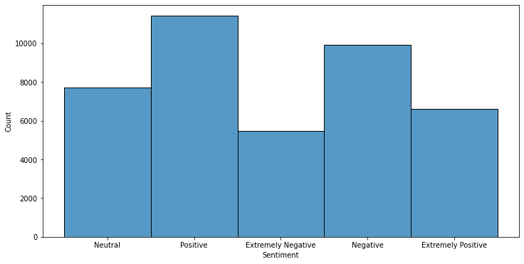
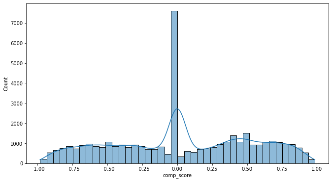
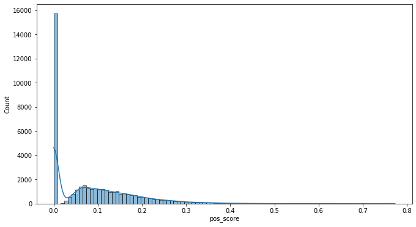
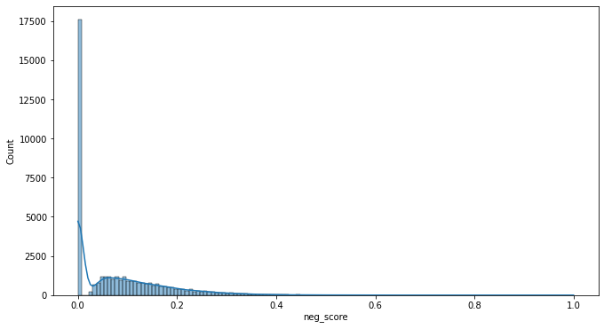
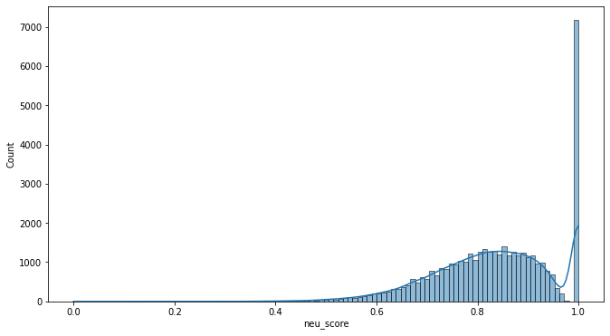
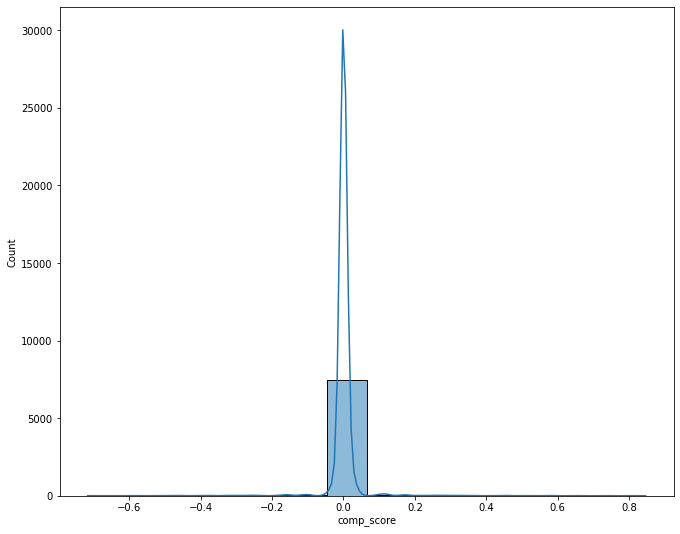
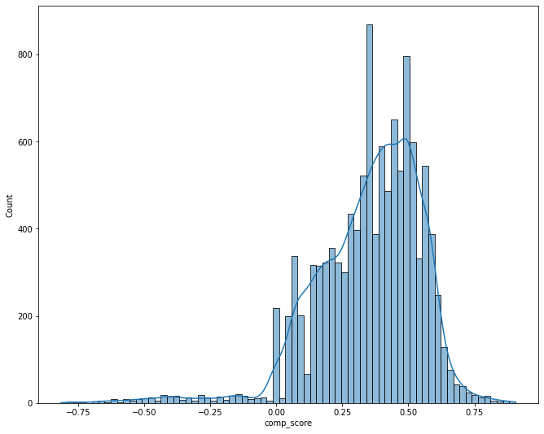
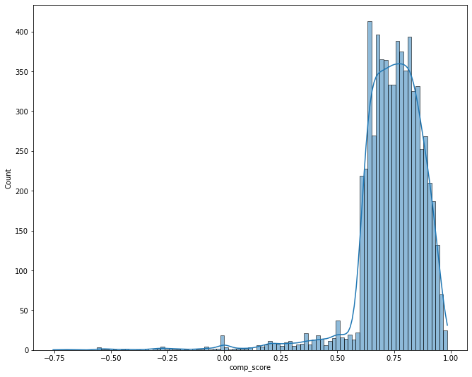
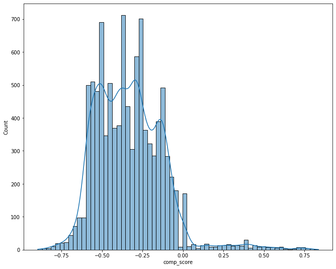
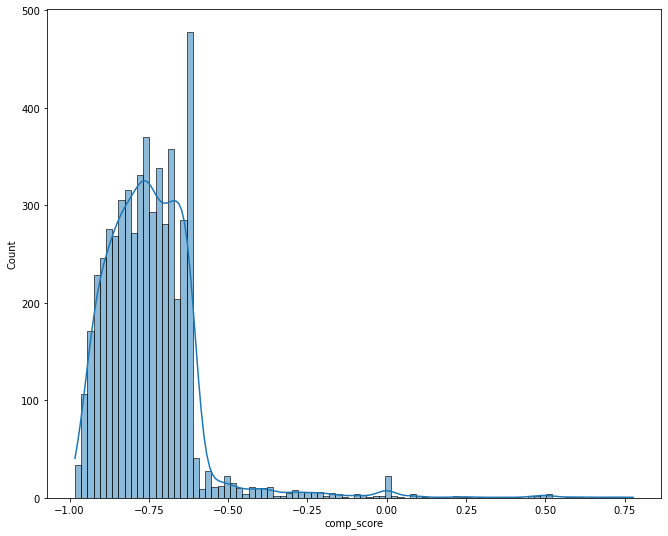

```python
import numpy as np
import pandas as pd
import matplotlib.pyplot as plt
import seaborn as sns
import spacy
```


```python
df = pd.read_csv("Corona_NLP_train.csv")
```


```python
df.head()
```


<div>
<style scoped>
    .dataframe tbody tr th:only-of-type {
        vertical-align: middle;
    }

    .dataframe tbody tr th {
        vertical-align: top;
    }

    .dataframe thead th {
        text-align: right;
    }
</style>
<table border="1" class="dataframe">
  <thead>
    <tr style="text-align: right;">
      <th></th>
      <th>UserName</th>
      <th>ScreenName</th>
      <th>Location</th>
      <th>TweetAt</th>
      <th>OriginalTweet</th>
      <th>Sentiment</th>
    </tr>
  </thead>
  <tbody>
    <tr>
      <th>0</th>
      <td>3799</td>
      <td>48751</td>
      <td>London</td>
      <td>16-03-2020</td>
      <td>@MeNyrbie @Phil_Gahan @Chrisitv https://t.co/i...</td>
      <td>Neutral</td>
    </tr>
    <tr>
      <th>1</th>
      <td>3800</td>
      <td>48752</td>
      <td>UK</td>
      <td>16-03-2020</td>
      <td>advice Talk to your neighbours family to excha...</td>
      <td>Positive</td>
    </tr>
    <tr>
      <th>2</th>
      <td>3801</td>
      <td>48753</td>
      <td>Vagabonds</td>
      <td>16-03-2020</td>
      <td>Coronavirus Australia: Woolworths to give elde...</td>
      <td>Positive</td>
    </tr>
    <tr>
      <th>3</th>
      <td>3802</td>
      <td>48754</td>
      <td>NaN</td>
      <td>16-03-2020</td>
      <td>My food stock is not the only one which is emp...</td>
      <td>Positive</td>
    </tr>
    <tr>
      <th>4</th>
      <td>3803</td>
      <td>48755</td>
      <td>NaN</td>
      <td>16-03-2020</td>
      <td>Me, ready to go at supermarket during the #COV...</td>
      <td>Extremely Negative</td>
    </tr>
  </tbody>
</table>
</div>


```python
df_tweets=df[['OriginalTweet','Sentiment']]
```


```python
df_tweets.head()
```


<div>
<style scoped>
    .dataframe tbody tr th:only-of-type {
        vertical-align: middle;
    }

    .dataframe tbody tr th {
        vertical-align: top;
    }

    .dataframe thead th {
        text-align: right;
    }
</style>
<table border="1" class="dataframe">
  <thead>
    <tr style="text-align: right;">
      <th></th>
      <th>OriginalTweet</th>
      <th>Sentiment</th>
    </tr>
  </thead>
  <tbody>
    <tr>
      <th>0</th>
      <td>@MeNyrbie @Phil_Gahan @Chrisitv https://t.co/i...</td>
      <td>Neutral</td>
    </tr>
    <tr>
      <th>1</th>
      <td>advice Talk to your neighbours family to excha...</td>
      <td>Positive</td>
    </tr>
    <tr>
      <th>2</th>
      <td>Coronavirus Australia: Woolworths to give elde...</td>
      <td>Positive</td>
    </tr>
    <tr>
      <th>3</th>
      <td>My food stock is not the only one which is emp...</td>
      <td>Positive</td>
    </tr>
    <tr>
      <th>4</th>
      <td>Me, ready to go at supermarket during the #COV...</td>
      <td>Extremely Negative</td>
    </tr>
  </tbody>
</table>
</div>


```python
100 * df_tweets['Sentiment'].value_counts()/len(df_tweets)
```


    Positive              27.752266
    Negative              24.095537
    Neutral               18.740433
    Extremely Positive    16.094468
    Extremely Negative    13.317297
    Name: Sentiment, dtype: float64


```python
df_tweets.isna().sum()
```


    OriginalTweet    0
    Sentiment        0
    dtype: int64


```python
# Checking if there are any "blank" tweets. If there are, then we'll remove such tweets.
blanks = []
for i, tweet, lb in df_tweets.itertuples():
    if type(tweet) == str:
        if tweet.isspace():
            blanks.append(i)
```


```python
blanks # no blank tweets
```


    []


# EDA


```python
plt.figure(figsize=(12,6))
sns.histplot(data=df_tweets,x='Sentiment')
```


    <AxesSubplot:xlabel='Sentiment', ylabel='Count'>


    

    


#### Inference:
We can see that most of the samples (tweets) have "positive" sentiment. Next, are the tweets having "Negative" sentiments, after that comes tweets with "Neutral" sentiments. Then, we can see the "extreme cases" lead by "Extremely Positive" sentiments and followed by "Extremely Negative" sentiments.

#### Let's try to analyze these tweets with respect to their sentiment polarity scores (positve score, negative score, neutral score and compound score)


```python
df2 = df_tweets.copy()
```


```python
from nltk.sentiment import SentimentIntensityAnalyzer
```


```python
sia = SentimentIntensityAnalyzer()
```


```python
sia.polarity_scores(df2['OriginalTweet'][3])
```


    {'neg': 0.0, 'neu': 0.777, 'pos': 0.223, 'compound': 0.8731}


```python
df2['pos_score'] = df2["OriginalTweet"].apply(lambda x: sia.polarity_scores(x)['pos'])
df2['neg_score'] = df2["OriginalTweet"].apply(lambda x: sia.polarity_scores(x)['neg'])
df2['neu_score'] = df2["OriginalTweet"].apply(lambda x: sia.polarity_scores(x)['neu'])
df2['comp_score'] = df2["OriginalTweet"].apply(lambda x: sia.polarity_scores(x)['compound'])
```


```python
df2.head()
```


<div>
<style scoped>
    .dataframe tbody tr th:only-of-type {
        vertical-align: middle;
    }

    .dataframe tbody tr th {
        vertical-align: top;
    }

    .dataframe thead th {
        text-align: right;
    }
</style>
<table border="1" class="dataframe">
  <thead>
    <tr style="text-align: right;">
      <th></th>
      <th>OriginalTweet</th>
      <th>Sentiment</th>
      <th>pos_score</th>
      <th>neg_score</th>
      <th>neu_score</th>
      <th>comp_score</th>
    </tr>
  </thead>
  <tbody>
    <tr>
      <th>0</th>
      <td>@MeNyrbie @Phil_Gahan @Chrisitv https://t.co/i...</td>
      <td>Neutral</td>
      <td>0.000</td>
      <td>0.000</td>
      <td>1.000</td>
      <td>0.0000</td>
    </tr>
    <tr>
      <th>1</th>
      <td>advice Talk to your neighbours family to excha...</td>
      <td>Positive</td>
      <td>0.077</td>
      <td>0.000</td>
      <td>0.923</td>
      <td>0.2500</td>
    </tr>
    <tr>
      <th>2</th>
      <td>Coronavirus Australia: Woolworths to give elde...</td>
      <td>Positive</td>
      <td>0.188</td>
      <td>0.000</td>
      <td>0.812</td>
      <td>0.4588</td>
    </tr>
    <tr>
      <th>3</th>
      <td>My food stock is not the only one which is emp...</td>
      <td>Positive</td>
      <td>0.223</td>
      <td>0.000</td>
      <td>0.777</td>
      <td>0.8731</td>
    </tr>
    <tr>
      <th>4</th>
      <td>Me, ready to go at supermarket during the #COV...</td>
      <td>Extremely Negative</td>
      <td>0.208</td>
      <td>0.079</td>
      <td>0.713</td>
      <td>0.7161</td>
    </tr>
  </tbody>
</table>
</div>


```python
plt.figure(figsize=(11,6))
sns.histplot(data=df2,x='comp_score',kde=True)
```


    <AxesSubplot:xlabel='comp_score', ylabel='Count'>


    

    


#### Inference:
We can notice almost a perfect normal distribution with wide tails. The plot is almost symmetric, with a slightly highert height around the positive region which could be due to the higher number of positive and extremely positive number of tweets.


```python
plt.figure(figsize=(11,6))
sns.histplot(data=df2,x='pos_score',kde=True)
```


    <AxesSubplot:xlabel='pos_score', ylabel='Count'>


    

    


#### Inference:
The positive score of tweets seems to distributed in a highly right skewed normal distribution manner, with a slight peak occuring around 0.06 - 0.08. However, we can see that a very high number of tweets (around 16000) have a pos_score of 0 indicating that they are either highly negative, negative or neutral. All the non-positive number of tweets are summed in that one single bar.


```python
plt.figure(figsize=(11,6))
sns.histplot(data=df2,x='neg_score',kde=True)
```


    <AxesSubplot:xlabel='neg_score', ylabel='Count'>


    

    


#### Inference:
The negative score of tweets seems to distributed in a highly right skewed normal distribution manner, with a slight peak occuring around 0.08 - 0.12. However, we can see that a very high number of tweets (around 17500) have a neg_score of 0 indicating that they are either highly positive, positive or neutral. All the non-negative number of tweets are summed in that one single bar.


```python
plt.figure(figsize=(11,6))
sns.histplot(data=df2,x='neu_score',kde=True)
```


    <AxesSubplot:xlabel='neu_score', ylabel='Count'>


    

    


#### Inference:
The distribution is of the form highly left skewed normal distribution. We can see "humped peak" around a neu_score of 0.85. High number of "absolutely neutral" tweets are present (around 7000), indicated by a single bar.

The above 4 graphs show that except comp_score all the scores have a high skewed distribution followed/preceeded by a single long bar (indicating all those scores which are not present in that particular score category)

#### Now, Let's focus on the comp_score of each sentiment

#### Neutral


```python
plt.figure(figsize=(11,9))
sns.histplot(data=df2[df2['Sentiment']=='Neutral'],x='comp_score',kde=True)
```


    <AxesSubplot:xlabel='comp_score', ylabel='Count'>


    

    


#### Inference:
For "Neutral" tweets, we can see a peak around comp_score of 0, with a symmetric tails. The distribution is normal and symmetric with long tails. However, the tail on the positve side is slightly longer than the one on the left (due to higher number of positve tweets)

#### Positive


```python
plt.figure(figsize=(11,9))
sns.histplot(data=df2[df2['Sentiment']=='Positive'],x='comp_score',kde=True)
```


    <AxesSubplot:xlabel='comp_score', ylabel='Count'>


    

    


#### Inference:
For positve tweets, we can see a huge peak in comp_score from around 0.5 and the peak diminishes around 0.75. This could be due to the fact that tweets having comp_score of more than 0.5 are classified as "Highly Positive" and not just "Positive". However, we could see quite a few tweets which have comp_score of more than 0.75 being classified as only "Positive" and not "Highly Positive", this could be due to the fact that those tweets might be having a very high neu_score or neg_score.

#### Extremely Positive


```python
plt.figure(figsize=(11,9))
sns.histplot(data=df2[df2['Sentiment']=='Extremely Positive'],x='comp_score',kde=True)
```


    <AxesSubplot:xlabel='comp_score', ylabel='Count'>


    

    


```python
df2[(df2['Sentiment']=='Extremely Positive') & (df2['comp_score'] < -0.75)]
```


<div>
<style scoped>
    .dataframe tbody tr th:only-of-type {
        vertical-align: middle;
    }

    .dataframe tbody tr th {
        vertical-align: top;
    }

    .dataframe thead th {
        text-align: right;
    }
</style>
<table border="1" class="dataframe">
  <thead>
    <tr style="text-align: right;">
      <th></th>
      <th>OriginalTweet</th>
      <th>Sentiment</th>
      <th>pos_score</th>
      <th>neg_score</th>
      <th>neu_score</th>
      <th>comp_score</th>
    </tr>
  </thead>
  <tbody>
    <tr>
      <th>3738</th>
      <td>Well...\r\r\n The free testing won't work for ...</td>
      <td>Extremely Positive</td>
      <td>0.112</td>
      <td>0.279</td>
      <td>0.609</td>
      <td>-0.7561</td>
    </tr>
  </tbody>
</table>
</div>


#### Inference:
In case of "Highly Positive" tweets, we can see a huge peak jump around 0.75 which diminshes at 1 (because 1 is the max score). This peak takes place right off from the point where the peak of "Positive" tweets end, proving our assumption (comp_score greater than 0.75 being classified as "Highly Positive" tweets) to be correct. We can even spot a few outliers having the comp_score of around -0.75, which could be due to the fact those tweets having high neg_score and neu_score than the pos_score. It could also be the case such tweets are misclassified (possibly due to some error in the initial classifying system)

#### Negative


```python
plt.figure(figsize=(11,9))
sns.histplot(data=df2[df2['Sentiment']=='Negative'],x='comp_score',kde=True)
```


    <AxesSubplot:xlabel='comp_score', ylabel='Count'>


    

    


#### Inference:
We can see that the peak of this graph is wobbly and is on the negative side. There is no "one peak", however, we can say that the region of peak starts from around -0.25 and ends a little bit before -0.75. This could be due to the fact that the statements having comp_score lower than -0.75 are classified as "Highly Negative" instead of just "Negative"

#### Extremely Negative


```python
plt.figure(figsize=(11,9))
sns.histplot(data=df2[df2['Sentiment']=='Extremely Negative'],x='comp_score',kde=True)
```


    <AxesSubplot:xlabel='comp_score', ylabel='Count'>


    

    


```python
df2[(df2['Sentiment']=='Extremely Negative') & (df2['comp_score'] > 0.75)]
```


<div>
<style scoped>
    .dataframe tbody tr th:only-of-type {
        vertical-align: middle;
    }

    .dataframe tbody tr th {
        vertical-align: top;
    }

    .dataframe thead th {
        text-align: right;
    }
</style>
<table border="1" class="dataframe">
  <thead>
    <tr style="text-align: right;">
      <th></th>
      <th>OriginalTweet</th>
      <th>Sentiment</th>
      <th>pos_score</th>
      <th>neg_score</th>
      <th>neu_score</th>
      <th>comp_score</th>
    </tr>
  </thead>
  <tbody>
    <tr>
      <th>5485</th>
      <td>Stay home if you can! Please, this COVID-19 is...</td>
      <td>Extremely Negative</td>
      <td>0.200</td>
      <td>0.032</td>
      <td>0.768</td>
      <td>0.7763</td>
    </tr>
    <tr>
      <th>19850</th>
      <td>Gas prices are falling across the US, but cons...</td>
      <td>Extremely Negative</td>
      <td>0.267</td>
      <td>0.159</td>
      <td>0.574</td>
      <td>0.7523</td>
    </tr>
  </tbody>
</table>
</div>


#### Inference:
In case of "Highly Negative" tweets, we can see a huge peak jump around -0.75 which diminshes at 1 (because -1 is the min score). This peak takes place right off from the point where the peak of "Negative" tweets end, proving our assumption (comp_score less than -0.75 being classified as "Highly Negative" tweets) to be correct. We can even spot a few outliers having the comp_score of around +0.75, which could be due to the fact those tweets having high pos_score and neu_score than the pos_score. It could also be the case such tweets are misclassified (possibly due to some error in the initial classifying system)

#### Note:
We can notice that the graphs of "Highly Positive" and "Highly Negative" graphs are almost mirror image of each other, indicating an almost symmetric distribution around the "Extreme" values. This was also noticed earlier when we plotted "neu_score" 

## Implementing ML algos

#### Splitting the data into train and test set


```python
X = df_tweets['OriginalTweet']
y = df_tweets['Sentiment']
```


```python
from sklearn.model_selection import train_test_split
```


```python
X_train, X_test, y_train, y_test = train_test_split(X, y, test_size=0.33, random_state=42)
```

#### Creating pipelines (including Tfidf vectorization and then using classification algorithm)


```python
from sklearn.pipeline import Pipeline
```


```python
from sklearn.feature_extraction.text import TfidfVectorizer
```


```python
from sklearn.linear_model import LogisticRegression
from sklearn.svm import SVC,LinearSVC
from sklearn.naive_bayes import MultinomialNB
```


```python
p1 = Pipeline([('tfidf',TfidfVectorizer()), ('lr',LogisticRegression(max_iter=1000000,solver='saga'))]) # Logistic regression pipeline
p2 =  Pipeline([('tfidf',TfidfVectorizer()), ('lsvc',LinearSVC(random_state=42))]) # Linear SVC regression pipeline
p3 = Pipeline([('tfidf',TfidfVectorizer()), ('svc',SVC(random_state=42))]) # SVC regression pipeline
p4 =  Pipeline([('tfidf',TfidfVectorizer()), ('mnb',MultinomialNB())]) # Multinomial Naive bayes regression pipeline
```

#### 1) Logistic Regression


```python
p1.fit(X_train,y_train)
```


    Pipeline(steps=[('tfidf', TfidfVectorizer()),
                    ('lr', LogisticRegression(max_iter=1000000, solver='saga'))])


```python
lr_pred = p1.predict(X_test)
```


```python
from sklearn.metrics import classification_report,confusion_matrix
```


```python
print(classification_report(y_test,lr_pred))
print(confusion_matrix(y_test,lr_pred))
```

                        precision    recall  f1-score   support
    
    Extremely Negative       0.60      0.48      0.53      1753
    Extremely Positive       0.66      0.54      0.60      2190
              Negative       0.49      0.50      0.50      3300
               Neutral       0.62      0.63      0.63      2518
              Positive       0.51      0.60      0.55      3821
    
              accuracy                           0.56     13582
             macro avg       0.58      0.55      0.56     13582
          weighted avg       0.56      0.56      0.56     13582
    
    [[ 834   23  715   70  111]
     [  16 1186   74   59  855]
     [ 414   80 1661  431  714]
     [  33   30  349 1594  512]
     [  87  467  575  401 2291]]
    

#### 2) Linear SVC


```python
p2.fit(X_train,y_train)
lsvc_pred = p2.predict(X_test)
print(classification_report(y_test,lsvc_pred))
print(confusion_matrix(y_test,lsvc_pred))
```

                        precision    recall  f1-score   support
    
    Extremely Negative       0.58      0.63      0.60      1753
    Extremely Positive       0.60      0.67      0.63      2190
              Negative       0.49      0.44      0.46      3300
               Neutral       0.62      0.64      0.63      2518
              Positive       0.51      0.49      0.50      3821
    
              accuracy                           0.55     13582
             macro avg       0.56      0.57      0.57     13582
          weighted avg       0.55      0.55      0.55     13582
    
    [[1096   24  507   46   80]
     [  16 1458   56   52  608]
     [ 645  111 1464  428  652]
     [  44   43  359 1618  454]
     [  86  788  627  452 1868]]
    

#### 3) SVC


```python
# SVC not good for this case
p3.fit(X_train,y_train)
svc_pred = p3.predict(X_test)
print(classification_report(y_test,svc_pred))
print(confusion_matrix(y_test,svc_pred))
```

                        precision    recall  f1-score   support
    
    Extremely Negative       0.70      0.44      0.54      1753
    Extremely Positive       0.76      0.49      0.60      2190
              Negative       0.51      0.56      0.54      3300
               Neutral       0.66      0.61      0.63      2518
              Positive       0.51      0.68      0.58      3821
    
              accuracy                           0.58     13582
             macro avg       0.63      0.56      0.58     13582
          weighted avg       0.60      0.58      0.58     13582
    
    [[ 763   10  786   52  142]
     [   8 1077   72   54  979]
     [ 253   43 1862  354  788]
     [  14   15  363 1535  591]
     [  55  271  574  330 2591]]
    

#### 4) Multinomial NB


```python
p4.fit(X_train,y_train)
mnb_pred = p4.predict(X_test)
print(classification_report(y_test,mnb_pred))
print(confusion_matrix(y_test,mnb_pred))
```

                        precision    recall  f1-score   support
    
    Extremely Negative       0.87      0.01      0.01      1753
    Extremely Positive       0.89      0.01      0.02      2190
              Negative       0.40      0.34      0.37      3300
               Neutral       0.85      0.05      0.09      2518
              Positive       0.33      0.93      0.49      3821
    
              accuracy                           0.35     13582
             macro avg       0.67      0.27      0.20     13582
          weighted avg       0.60      0.35      0.25     13582
    
    [[  13    0 1028    1  711]
     [   0   25   36    1 2128]
     [   2    0 1121   14 2163]
     [   0    1  346  116 2055]
     [   0    2  279    4 3536]]
    

#### 5) Random Forest


```python
from sklearn.ensemble import RandomForestClassifier
```


```python
p5 = Pipeline([('tfidf',TfidfVectorizer()), ('rf',RandomForestClassifier(n_estimators=100,random_state=42))])
```


```python
p5.fit(X_train,y_train)
rf_pred = p5.predict(X_test)
print(classification_report(y_test,rf_pred))
print(confusion_matrix(y_test,rf_pred))
```

                        precision    recall  f1-score   support
    
    Extremely Negative       0.67      0.26      0.37      1753
    Extremely Positive       0.68      0.30      0.41      2190
              Negative       0.44      0.44      0.44      3300
               Neutral       0.50      0.64      0.56      2518
              Positive       0.41      0.58      0.48      3821
    
              accuracy                           0.47     13582
             macro avg       0.54      0.44      0.45     13582
          weighted avg       0.51      0.47      0.46     13582
    
    [[ 455   16  774  143  365]
     [  12  652  141  163 1222]
     [ 155   65 1457  617 1006]
     [  13   18  291 1621  575]
     [  42  209  651  707 2212]]
    

#### 6) XGBOOST


```python
from xgboost import XGBClassifier
```


```python
p6 = Pipeline([('tfidf',TfidfVectorizer()), ("xgb",XGBClassifier(random_state=42,booster='dart'))])
```


```python
p6.fit(X_train,y_train)
xgb_pred = p6.predict(X_test)
print(classification_report(y_test,xgb_pred))
print(confusion_matrix(y_test,xgb_pred))
```

    E:\anaconda\lib\site-packages\xgboost\sklearn.py:888: UserWarning: The use of label encoder in XGBClassifier is deprecated and will be removed in a future release. To remove this warning, do the following: 1) Pass option use_label_encoder=False when constructing XGBClassifier object; and 2) Encode your labels (y) as integers starting with 0, i.e. 0, 1, 2, ..., [num_class - 1].
      warnings.warn(label_encoder_deprecation_msg, UserWarning)
    

    [02:46:28] WARNING: C:/Users/Administrator/workspace/xgboost-win64_release_1.3.0/src/learner.cc:1061: Starting in XGBoost 1.3.0, the default evaluation metric used with the objective 'multi:softprob' was changed from 'merror' to 'mlogloss'. Explicitly set eval_metric if you'd like to restore the old behavior.
                        precision    recall  f1-score   support
    
    Extremely Negative       0.61      0.47      0.53      1753
    Extremely Positive       0.66      0.48      0.56      2190
              Negative       0.52      0.44      0.47      3300
               Neutral       0.54      0.75      0.63      2518
              Positive       0.49      0.56      0.52      3821
    
              accuracy                           0.54     13582
             macro avg       0.57      0.54      0.54     13582
          weighted avg       0.55      0.54      0.54     13582
    
    [[ 821   36  569  155  172]
     [  15 1053   81  106  935]
     [ 370   99 1449  654  728]
     [  32   21  180 1892  393]
     [ 102  378  529  666 2146]]
    

#### 7) XGBRFBOOST


```python
from xgboost import XGBRFClassifier
```


```python
p7 = Pipeline([('tfidf',TfidfVectorizer()), ("xgbrf",XGBRFClassifier(random_state=42,booster='dart'))])
p7.fit(X_train,y_train)
xgbrf_pred = p7.predict(X_test)
print(classification_report(y_test,xgbrf_pred))
print(confusion_matrix(y_test,xgbrf_pred))
```

    E:\anaconda\lib\site-packages\xgboost\sklearn.py:888: UserWarning: The use of label encoder in XGBClassifier is deprecated and will be removed in a future release. To remove this warning, do the following: 1) Pass option use_label_encoder=False when constructing XGBClassifier object; and 2) Encode your labels (y) as integers starting with 0, i.e. 0, 1, 2, ..., [num_class - 1].
      warnings.warn(label_encoder_deprecation_msg, UserWarning)
    

    [02:52:06] WARNING: C:/Users/Administrator/workspace/xgboost-win64_release_1.3.0/src/learner.cc:1061: Starting in XGBoost 1.3.0, the default evaluation metric used with the objective 'multi:softprob' was changed from 'merror' to 'mlogloss'. Explicitly set eval_metric if you'd like to restore the old behavior.
                        precision    recall  f1-score   support
    
    Extremely Negative       0.52      0.32      0.40      1753
    Extremely Positive       0.53      0.33      0.40      2190
              Negative       0.45      0.22      0.30      3300
               Neutral       0.42      0.45      0.44      2518
              Positive       0.33      0.58      0.42      3821
    
              accuracy                           0.40     13582
             macro avg       0.45      0.38      0.39     13582
          weighted avg       0.43      0.40      0.39     13582
    
    [[ 565   43  350  154  641]
     [  46  718   81  179 1166]
     [ 338  123  732  568 1539]
     [  33   25   80 1141 1239]
     [ 109  452  377  669 2214]]
    

#### 8) Catboost


```python
from catboost import CatBoostClassifier
```


```python
tfidf = TfidfVectorizer()
```


```python
X_train_vect = tfidf.fit_transform(X_train)
X_test_vect = tfidf.transform(X_test)
```


```python
p8 = Pipeline([('tfidf',TfidfVectorizer()), ("cb",CatBoostClassifier(random_state=42))])
p8.fit(X_train,y_train)
cb_pred = p8.predict(X_test)
print(classification_report(y_test,cb_pred))
print(confusion_matrix(y_test,cb_pred))
```

    Learning rate set to 0.093711
    0:	learn: 1.5874382	total: 16.6s	remaining: 4h 36m 18s
    1:	learn: 1.5683432	total: 21.2s	remaining: 2h 56m 12s
    2:	learn: 1.5508502	total: 22.7s	remaining: 2h 5m 32s
    3:	learn: 1.5358196	total: 24.2s	remaining: 1h 40m 27s
    4:	learn: 1.5228087	total: 25.6s	remaining: 1h 25m 1s
    5:	learn: 1.5121974	total: 27s	remaining: 1h 14m 37s
    6:	learn: 1.5018813	total: 28.4s	remaining: 1h 7m 5s
    7:	learn: 1.4900895	total: 29.7s	remaining: 1h 1m 25s
    8:	learn: 1.4819609	total: 31.1s	remaining: 57m 1s
    9:	learn: 1.4742165	total: 32.4s	remaining: 53m 31s
    10:	learn: 1.4659796	total: 33.9s	remaining: 50m 45s
    11:	learn: 1.4594622	total: 35.2s	remaining: 48m 19s
    12:	learn: 1.4534198	total: 36.6s	remaining: 46m 18s
    13:	learn: 1.4476310	total: 38s	remaining: 44m 34s
    14:	learn: 1.4429218	total: 39.6s	remaining: 43m 18s
    15:	learn: 1.4375995	total: 41s	remaining: 42m 3s
    16:	learn: 1.4333447	total: 42.4s	remaining: 40m 52s
    17:	learn: 1.4287142	total: 43.8s	remaining: 39m 50s
    18:	learn: 1.4234941	total: 45.2s	remaining: 38m 53s
    19:	learn: 1.4194609	total: 46.6s	remaining: 38m 4s
    20:	learn: 1.4150920	total: 48s	remaining: 37m 16s
    21:	learn: 1.4114058	total: 49.4s	remaining: 36m 35s
    22:	learn: 1.4082539	total: 50.8s	remaining: 35m 57s
    23:	learn: 1.4045688	total: 52.2s	remaining: 35m 23s
    24:	learn: 1.4006089	total: 53.6s	remaining: 34m 50s
    25:	learn: 1.3970120	total: 55.1s	remaining: 34m 25s
    26:	learn: 1.3939818	total: 56.6s	remaining: 33m 58s
    27:	learn: 1.3908046	total: 58s	remaining: 33m 33s
    28:	learn: 1.3882023	total: 59.4s	remaining: 33m 7s
    29:	learn: 1.3858503	total: 1m	remaining: 32m 48s
    30:	learn: 1.3826501	total: 1m 2s	remaining: 32m 30s
    31:	learn: 1.3797147	total: 1m 3s	remaining: 32m 11s
    32:	learn: 1.3776514	total: 1m 5s	remaining: 31m 51s
    33:	learn: 1.3749836	total: 1m 6s	remaining: 31m 37s
    34:	learn: 1.3728133	total: 1m 8s	remaining: 31m 22s
    35:	learn: 1.3701901	total: 1m 9s	remaining: 31m 6s
    36:	learn: 1.3672386	total: 1m 11s	remaining: 30m 57s
    37:	learn: 1.3648119	total: 1m 12s	remaining: 30m 43s
    38:	learn: 1.3620313	total: 1m 14s	remaining: 30m 30s
    39:	learn: 1.3596611	total: 1m 15s	remaining: 30m 17s
    40:	learn: 1.3573019	total: 1m 17s	remaining: 30m 4s
    41:	learn: 1.3551774	total: 1m 18s	remaining: 29m 53s
    42:	learn: 1.3528186	total: 1m 20s	remaining: 29m 42s
    43:	learn: 1.3510698	total: 1m 21s	remaining: 29m 31s
    44:	learn: 1.3496004	total: 1m 22s	remaining: 29m 19s
    45:	learn: 1.3476018	total: 1m 24s	remaining: 29m 8s
    46:	learn: 1.3455000	total: 1m 25s	remaining: 28m 58s
    47:	learn: 1.3438540	total: 1m 27s	remaining: 28m 52s
    48:	learn: 1.3414477	total: 1m 28s	remaining: 28m 42s
    49:	learn: 1.3396772	total: 1m 30s	remaining: 28m 33s
    50:	learn: 1.3374657	total: 1m 31s	remaining: 28m 23s
    51:	learn: 1.3357507	total: 1m 32s	remaining: 28m 14s
    52:	learn: 1.3339531	total: 1m 34s	remaining: 28m 6s
    53:	learn: 1.3323508	total: 1m 35s	remaining: 27m 58s
    54:	learn: 1.3304886	total: 1m 37s	remaining: 27m 50s
    55:	learn: 1.3288180	total: 1m 38s	remaining: 27m 42s
    56:	learn: 1.3273025	total: 1m 40s	remaining: 27m 35s
    57:	learn: 1.3257608	total: 1m 41s	remaining: 27m 28s
    58:	learn: 1.3244712	total: 1m 43s	remaining: 27m 23s
    59:	learn: 1.3230395	total: 1m 44s	remaining: 27m 17s
    60:	learn: 1.3211881	total: 1m 45s	remaining: 27m 10s
    61:	learn: 1.3195775	total: 1m 47s	remaining: 27m 3s
    62:	learn: 1.3175701	total: 1m 48s	remaining: 26m 57s
    63:	learn: 1.3160188	total: 1m 50s	remaining: 26m 51s
    64:	learn: 1.3146487	total: 1m 51s	remaining: 26m 45s
    65:	learn: 1.3128528	total: 1m 53s	remaining: 26m 39s
    66:	learn: 1.3112915	total: 1m 54s	remaining: 26m 33s
    67:	learn: 1.3095891	total: 1m 55s	remaining: 26m 27s
    68:	learn: 1.3077974	total: 1m 57s	remaining: 26m 21s
    69:	learn: 1.3068146	total: 1m 58s	remaining: 26m 17s
    70:	learn: 1.3058136	total: 2m	remaining: 26m 13s
    71:	learn: 1.3046010	total: 2m 1s	remaining: 26m 9s
    72:	learn: 1.3032568	total: 2m 3s	remaining: 26m 3s
    73:	learn: 1.3019243	total: 2m 4s	remaining: 25m 58s
    74:	learn: 1.3008220	total: 2m 6s	remaining: 25m 54s
    75:	learn: 1.2990639	total: 2m 7s	remaining: 25m 49s
    76:	learn: 1.2977714	total: 2m 8s	remaining: 25m 44s
    77:	learn: 1.2965085	total: 2m 10s	remaining: 25m 39s
    78:	learn: 1.2951071	total: 2m 11s	remaining: 25m 34s
    79:	learn: 1.2933579	total: 2m 13s	remaining: 25m 30s
    80:	learn: 1.2921909	total: 2m 14s	remaining: 25m 27s
    81:	learn: 1.2906187	total: 2m 16s	remaining: 25m 24s
    82:	learn: 1.2892465	total: 2m 17s	remaining: 25m 19s
    83:	learn: 1.2884138	total: 2m 18s	remaining: 25m 15s
    84:	learn: 1.2870077	total: 2m 20s	remaining: 25m 11s
    85:	learn: 1.2857046	total: 2m 21s	remaining: 25m 6s
    86:	learn: 1.2844445	total: 2m 23s	remaining: 25m 2s
    87:	learn: 1.2826885	total: 2m 24s	remaining: 24m 58s
    88:	learn: 1.2817630	total: 2m 25s	remaining: 24m 54s
    89:	learn: 1.2804587	total: 2m 27s	remaining: 24m 50s
    90:	learn: 1.2793026	total: 2m 28s	remaining: 24m 46s
    91:	learn: 1.2786448	total: 2m 30s	remaining: 24m 43s
    92:	learn: 1.2773816	total: 2m 31s	remaining: 24m 41s
    93:	learn: 1.2760126	total: 2m 33s	remaining: 24m 37s
    94:	learn: 1.2751126	total: 2m 34s	remaining: 24m 35s
    95:	learn: 1.2738919	total: 2m 36s	remaining: 24m 31s
    96:	learn: 1.2726805	total: 2m 37s	remaining: 24m 28s
    97:	learn: 1.2719527	total: 2m 39s	remaining: 24m 24s
    98:	learn: 1.2711951	total: 2m 40s	remaining: 24m 21s
    99:	learn: 1.2702317	total: 2m 41s	remaining: 24m 17s
    100:	learn: 1.2692661	total: 2m 43s	remaining: 24m 14s
    101:	learn: 1.2682933	total: 2m 44s	remaining: 24m 10s
    102:	learn: 1.2671942	total: 2m 46s	remaining: 24m 8s
    103:	learn: 1.2658791	total: 2m 47s	remaining: 24m 6s
    104:	learn: 1.2646749	total: 2m 49s	remaining: 24m 2s
    105:	learn: 1.2634926	total: 2m 50s	remaining: 24m 1s
    106:	learn: 1.2622964	total: 2m 52s	remaining: 23m 57s
    107:	learn: 1.2611617	total: 2m 53s	remaining: 23m 54s
    108:	learn: 1.2598624	total: 2m 55s	remaining: 23m 51s
    109:	learn: 1.2586635	total: 2m 56s	remaining: 23m 48s
    110:	learn: 1.2578742	total: 2m 57s	remaining: 23m 44s
    111:	learn: 1.2568622	total: 2m 59s	remaining: 23m 42s
    112:	learn: 1.2556665	total: 3m	remaining: 23m 39s
    113:	learn: 1.2543836	total: 3m 2s	remaining: 23m 38s
    114:	learn: 1.2530595	total: 3m 4s	remaining: 23m 36s
    115:	learn: 1.2520809	total: 3m 5s	remaining: 23m 34s
    116:	learn: 1.2510532	total: 3m 7s	remaining: 23m 31s
    117:	learn: 1.2498758	total: 3m 8s	remaining: 23m 28s
    118:	learn: 1.2485254	total: 3m 9s	remaining: 23m 25s
    119:	learn: 1.2474380	total: 3m 11s	remaining: 23m 22s
    120:	learn: 1.2460643	total: 3m 12s	remaining: 23m 19s
    121:	learn: 1.2449048	total: 3m 14s	remaining: 23m 16s
    122:	learn: 1.2440557	total: 3m 15s	remaining: 23m 13s
    123:	learn: 1.2427394	total: 3m 16s	remaining: 23m 10s
    124:	learn: 1.2416516	total: 3m 18s	remaining: 23m 9s
    125:	learn: 1.2402658	total: 3m 20s	remaining: 23m 7s
    126:	learn: 1.2392384	total: 3m 21s	remaining: 23m 4s
    127:	learn: 1.2382126	total: 3m 22s	remaining: 23m 1s
    128:	learn: 1.2369173	total: 3m 24s	remaining: 22m 58s
    129:	learn: 1.2357084	total: 3m 25s	remaining: 22m 55s
    130:	learn: 1.2351660	total: 3m 27s	remaining: 22m 53s
    131:	learn: 1.2342184	total: 3m 28s	remaining: 22m 50s
    132:	learn: 1.2328266	total: 3m 29s	remaining: 22m 47s
    133:	learn: 1.2318408	total: 3m 31s	remaining: 22m 45s
    134:	learn: 1.2305147	total: 3m 32s	remaining: 22m 42s
    135:	learn: 1.2297090	total: 3m 34s	remaining: 22m 40s
    136:	learn: 1.2287325	total: 3m 35s	remaining: 22m 39s
    137:	learn: 1.2277175	total: 3m 37s	remaining: 22m 37s
    138:	learn: 1.2267721	total: 3m 38s	remaining: 22m 35s
    139:	learn: 1.2258411	total: 3m 40s	remaining: 22m 33s
    140:	learn: 1.2249976	total: 3m 41s	remaining: 22m 31s
    141:	learn: 1.2241123	total: 3m 43s	remaining: 22m 29s
    142:	learn: 1.2232305	total: 3m 44s	remaining: 22m 26s
    143:	learn: 1.2223032	total: 3m 46s	remaining: 22m 24s
    144:	learn: 1.2216044	total: 3m 47s	remaining: 22m 22s
    145:	learn: 1.2204914	total: 3m 49s	remaining: 22m 19s
    146:	learn: 1.2196888	total: 3m 50s	remaining: 22m 17s
    147:	learn: 1.2186464	total: 3m 52s	remaining: 22m 16s
    148:	learn: 1.2178664	total: 3m 53s	remaining: 22m 13s
    149:	learn: 1.2170753	total: 3m 54s	remaining: 22m 11s
    150:	learn: 1.2161632	total: 3m 56s	remaining: 22m 8s
    151:	learn: 1.2152969	total: 3m 57s	remaining: 22m 6s
    152:	learn: 1.2144653	total: 3m 59s	remaining: 22m 4s
    153:	learn: 1.2135558	total: 4m	remaining: 22m 1s
    154:	learn: 1.2127781	total: 4m 2s	remaining: 22m
    155:	learn: 1.2118935	total: 4m 3s	remaining: 21m 57s
    156:	learn: 1.2109036	total: 4m 4s	remaining: 21m 55s
    157:	learn: 1.2098169	total: 4m 6s	remaining: 21m 53s
    158:	learn: 1.2089004	total: 4m 8s	remaining: 21m 52s
    159:	learn: 1.2081455	total: 4m 9s	remaining: 21m 50s
    160:	learn: 1.2075009	total: 4m 11s	remaining: 21m 48s
    161:	learn: 1.2065972	total: 4m 12s	remaining: 21m 46s
    162:	learn: 1.2057493	total: 4m 13s	remaining: 21m 43s
    163:	learn: 1.2048592	total: 4m 15s	remaining: 21m 41s
    164:	learn: 1.2040056	total: 4m 16s	remaining: 21m 39s
    165:	learn: 1.2028867	total: 4m 18s	remaining: 21m 37s
    166:	learn: 1.2019363	total: 4m 19s	remaining: 21m 35s
    167:	learn: 1.2011900	total: 4m 21s	remaining: 21m 33s
    168:	learn: 1.2003238	total: 4m 22s	remaining: 21m 31s
    169:	learn: 1.1995295	total: 4m 24s	remaining: 21m 30s
    170:	learn: 1.1988734	total: 4m 25s	remaining: 21m 27s
    171:	learn: 1.1979011	total: 4m 27s	remaining: 21m 25s
    172:	learn: 1.1972039	total: 4m 28s	remaining: 21m 23s
    173:	learn: 1.1964511	total: 4m 29s	remaining: 21m 21s
    174:	learn: 1.1956130	total: 4m 31s	remaining: 21m 19s
    175:	learn: 1.1950537	total: 4m 32s	remaining: 21m 16s
    176:	learn: 1.1940912	total: 4m 34s	remaining: 21m 14s
    177:	learn: 1.1934130	total: 4m 35s	remaining: 21m 12s
    178:	learn: 1.1928923	total: 4m 36s	remaining: 21m 10s
    179:	learn: 1.1922391	total: 4m 38s	remaining: 21m 8s
    180:	learn: 1.1914829	total: 4m 39s	remaining: 21m 6s
    181:	learn: 1.1907759	total: 4m 41s	remaining: 21m 4s
    182:	learn: 1.1901386	total: 4m 42s	remaining: 21m 2s
    183:	learn: 1.1894524	total: 4m 44s	remaining: 21m 1s
    184:	learn: 1.1887081	total: 4m 45s	remaining: 20m 59s
    185:	learn: 1.1880680	total: 4m 47s	remaining: 20m 57s
    186:	learn: 1.1872450	total: 4m 49s	remaining: 20m 57s
    187:	learn: 1.1865113	total: 4m 50s	remaining: 20m 55s
    188:	learn: 1.1859090	total: 4m 52s	remaining: 20m 54s
    189:	learn: 1.1853143	total: 4m 53s	remaining: 20m 52s
    190:	learn: 1.1847506	total: 4m 55s	remaining: 20m 50s
    191:	learn: 1.1838799	total: 4m 56s	remaining: 20m 49s
    192:	learn: 1.1831943	total: 4m 58s	remaining: 20m 46s
    193:	learn: 1.1823083	total: 4m 59s	remaining: 20m 44s
    194:	learn: 1.1816487	total: 5m 1s	remaining: 20m 42s
    195:	learn: 1.1808225	total: 5m 2s	remaining: 20m 40s
    196:	learn: 1.1801097	total: 5m 3s	remaining: 20m 38s
    197:	learn: 1.1794269	total: 5m 5s	remaining: 20m 36s
    198:	learn: 1.1786634	total: 5m 6s	remaining: 20m 34s
    199:	learn: 1.1782658	total: 5m 8s	remaining: 20m 32s
    200:	learn: 1.1776731	total: 5m 9s	remaining: 20m 30s
    201:	learn: 1.1770434	total: 5m 11s	remaining: 20m 29s
    202:	learn: 1.1763297	total: 5m 12s	remaining: 20m 27s
    203:	learn: 1.1756747	total: 5m 14s	remaining: 20m 25s
    204:	learn: 1.1748980	total: 5m 15s	remaining: 20m 23s
    205:	learn: 1.1741518	total: 5m 16s	remaining: 20m 21s
    206:	learn: 1.1735469	total: 5m 18s	remaining: 20m 20s
    207:	learn: 1.1729836	total: 5m 19s	remaining: 20m 18s
    208:	learn: 1.1722693	total: 5m 21s	remaining: 20m 16s
    209:	learn: 1.1716291	total: 5m 22s	remaining: 20m 14s
    210:	learn: 1.1711934	total: 5m 24s	remaining: 20m 12s
    211:	learn: 1.1705414	total: 5m 25s	remaining: 20m 10s
    212:	learn: 1.1699724	total: 5m 27s	remaining: 20m 9s
    213:	learn: 1.1693089	total: 5m 28s	remaining: 20m 7s
    214:	learn: 1.1685812	total: 5m 30s	remaining: 20m 5s
    215:	learn: 1.1682120	total: 5m 31s	remaining: 20m 3s
    216:	learn: 1.1676519	total: 5m 32s	remaining: 20m 1s
    217:	learn: 1.1671322	total: 5m 34s	remaining: 19m 59s
    218:	learn: 1.1666378	total: 5m 35s	remaining: 19m 57s
    219:	learn: 1.1661490	total: 5m 37s	remaining: 19m 55s
    220:	learn: 1.1654186	total: 5m 38s	remaining: 19m 53s
    221:	learn: 1.1649460	total: 5m 40s	remaining: 19m 52s
    222:	learn: 1.1643794	total: 5m 41s	remaining: 19m 50s
    223:	learn: 1.1637928	total: 5m 43s	remaining: 19m 48s
    224:	learn: 1.1632752	total: 5m 44s	remaining: 19m 47s
    225:	learn: 1.1627327	total: 5m 46s	remaining: 19m 45s
    226:	learn: 1.1621261	total: 5m 47s	remaining: 19m 43s
    227:	learn: 1.1617358	total: 5m 48s	remaining: 19m 41s
    228:	learn: 1.1611645	total: 5m 50s	remaining: 19m 39s
    229:	learn: 1.1608106	total: 5m 51s	remaining: 19m 37s
    230:	learn: 1.1601050	total: 5m 53s	remaining: 19m 35s
    231:	learn: 1.1596064	total: 5m 54s	remaining: 19m 33s
    232:	learn: 1.1590631	total: 5m 56s	remaining: 19m 32s
    233:	learn: 1.1585762	total: 5m 57s	remaining: 19m 30s
    234:	learn: 1.1579240	total: 5m 59s	remaining: 19m 29s
    235:	learn: 1.1573802	total: 6m	remaining: 19m 27s
    236:	learn: 1.1568493	total: 6m 2s	remaining: 19m 26s
    237:	learn: 1.1562679	total: 6m 3s	remaining: 19m 25s
    238:	learn: 1.1555862	total: 6m 5s	remaining: 19m 23s
    239:	learn: 1.1551184	total: 6m 6s	remaining: 19m 21s
    240:	learn: 1.1547864	total: 6m 8s	remaining: 19m 20s
    241:	learn: 1.1543979	total: 6m 9s	remaining: 19m 18s
    242:	learn: 1.1538423	total: 6m 11s	remaining: 19m 16s
    243:	learn: 1.1533970	total: 6m 12s	remaining: 19m 15s
    244:	learn: 1.1529352	total: 6m 14s	remaining: 19m 14s
    245:	learn: 1.1525655	total: 6m 16s	remaining: 19m 13s
    246:	learn: 1.1519073	total: 6m 17s	remaining: 19m 11s
    247:	learn: 1.1511219	total: 6m 19s	remaining: 19m 9s
    248:	learn: 1.1505980	total: 6m 20s	remaining: 19m 8s
    249:	learn: 1.1501253	total: 6m 22s	remaining: 19m 6s
    250:	learn: 1.1495291	total: 6m 23s	remaining: 19m 4s
    251:	learn: 1.1490808	total: 6m 24s	remaining: 19m 2s
    252:	learn: 1.1484188	total: 6m 26s	remaining: 19m
    253:	learn: 1.1477642	total: 6m 27s	remaining: 18m 58s
    254:	learn: 1.1471303	total: 6m 29s	remaining: 18m 57s
    255:	learn: 1.1467393	total: 6m 30s	remaining: 18m 55s
    256:	learn: 1.1463950	total: 6m 32s	remaining: 18m 54s
    257:	learn: 1.1458815	total: 6m 33s	remaining: 18m 52s
    258:	learn: 1.1452821	total: 6m 35s	remaining: 18m 50s
    259:	learn: 1.1447084	total: 6m 36s	remaining: 18m 48s
    260:	learn: 1.1441801	total: 6m 37s	remaining: 18m 46s
    261:	learn: 1.1437214	total: 6m 39s	remaining: 18m 44s
    262:	learn: 1.1433129	total: 6m 40s	remaining: 18m 43s
    263:	learn: 1.1428730	total: 6m 42s	remaining: 18m 41s
    264:	learn: 1.1424193	total: 6m 44s	remaining: 18m 40s
    265:	learn: 1.1418454	total: 6m 45s	remaining: 18m 39s
    266:	learn: 1.1414500	total: 6m 47s	remaining: 18m 39s
    267:	learn: 1.1406866	total: 6m 49s	remaining: 18m 38s
    268:	learn: 1.1402452	total: 6m 51s	remaining: 18m 37s
    269:	learn: 1.1397426	total: 6m 52s	remaining: 18m 35s
    270:	learn: 1.1391804	total: 6m 54s	remaining: 18m 34s
    271:	learn: 1.1387422	total: 6m 56s	remaining: 18m 33s
    272:	learn: 1.1383080	total: 6m 57s	remaining: 18m 32s
    273:	learn: 1.1378885	total: 6m 59s	remaining: 18m 32s
    274:	learn: 1.1374692	total: 7m 1s	remaining: 18m 31s
    275:	learn: 1.1371058	total: 7m 3s	remaining: 18m 31s
    276:	learn: 1.1366887	total: 7m 5s	remaining: 18m 30s
    277:	learn: 1.1363177	total: 7m 7s	remaining: 18m 29s
    278:	learn: 1.1358374	total: 7m 8s	remaining: 18m 28s
    279:	learn: 1.1354123	total: 7m 10s	remaining: 18m 27s
    280:	learn: 1.1350219	total: 7m 11s	remaining: 18m 25s
    281:	learn: 1.1345274	total: 7m 13s	remaining: 18m 24s
    282:	learn: 1.1341985	total: 7m 15s	remaining: 18m 23s
    283:	learn: 1.1337556	total: 7m 17s	remaining: 18m 22s
    284:	learn: 1.1333651	total: 7m 19s	remaining: 18m 22s
    285:	learn: 1.1329773	total: 7m 21s	remaining: 18m 21s
    286:	learn: 1.1324329	total: 7m 22s	remaining: 18m 20s
    287:	learn: 1.1318657	total: 7m 24s	remaining: 18m 18s
    288:	learn: 1.1315021	total: 7m 26s	remaining: 18m 17s
    289:	learn: 1.1311265	total: 7m 28s	remaining: 18m 17s
    290:	learn: 1.1306714	total: 7m 30s	remaining: 18m 17s
    291:	learn: 1.1301361	total: 7m 32s	remaining: 18m 16s
    292:	learn: 1.1295967	total: 7m 33s	remaining: 18m 15s
    293:	learn: 1.1292120	total: 7m 35s	remaining: 18m 14s
    294:	learn: 1.1289455	total: 7m 37s	remaining: 18m 13s
    295:	learn: 1.1287140	total: 7m 39s	remaining: 18m 12s
    296:	learn: 1.1284038	total: 7m 41s	remaining: 18m 12s
    297:	learn: 1.1279244	total: 7m 43s	remaining: 18m 11s
    298:	learn: 1.1274672	total: 7m 45s	remaining: 18m 10s
    299:	learn: 1.1268195	total: 7m 46s	remaining: 18m 9s
    300:	learn: 1.1264020	total: 7m 48s	remaining: 18m 7s
    301:	learn: 1.1259411	total: 7m 50s	remaining: 18m 6s
    302:	learn: 1.1255464	total: 7m 52s	remaining: 18m 6s
    303:	learn: 1.1252992	total: 7m 53s	remaining: 18m 4s
    304:	learn: 1.1249831	total: 7m 55s	remaining: 18m 3s
    305:	learn: 1.1244788	total: 7m 57s	remaining: 18m 2s
    306:	learn: 1.1242158	total: 7m 58s	remaining: 18m 1s
    307:	learn: 1.1240450	total: 8m	remaining: 17m 59s
    308:	learn: 1.1234751	total: 8m 2s	remaining: 17m 58s
    309:	learn: 1.1229573	total: 8m 4s	remaining: 17m 57s
    310:	learn: 1.1227163	total: 8m 5s	remaining: 17m 56s
    311:	learn: 1.1224147	total: 8m 7s	remaining: 17m 55s
    312:	learn: 1.1219044	total: 8m 9s	remaining: 17m 53s
    313:	learn: 1.1214317	total: 8m 10s	remaining: 17m 51s
    314:	learn: 1.1207851	total: 8m 12s	remaining: 17m 50s
    315:	learn: 1.1203501	total: 8m 13s	remaining: 17m 48s
    316:	learn: 1.1198306	total: 8m 15s	remaining: 17m 46s
    317:	learn: 1.1193819	total: 8m 16s	remaining: 17m 44s
    318:	learn: 1.1190683	total: 8m 18s	remaining: 17m 43s
    319:	learn: 1.1187194	total: 8m 19s	remaining: 17m 41s
    320:	learn: 1.1184313	total: 8m 21s	remaining: 17m 39s
    321:	learn: 1.1180615	total: 8m 22s	remaining: 17m 38s
    322:	learn: 1.1177130	total: 8m 24s	remaining: 17m 36s
    323:	learn: 1.1172640	total: 8m 25s	remaining: 17m 35s
    324:	learn: 1.1168336	total: 8m 27s	remaining: 17m 33s
    325:	learn: 1.1163893	total: 8m 28s	remaining: 17m 32s
    326:	learn: 1.1159564	total: 8m 30s	remaining: 17m 30s
    327:	learn: 1.1155218	total: 8m 32s	remaining: 17m 29s
    328:	learn: 1.1151163	total: 8m 33s	remaining: 17m 27s
    329:	learn: 1.1146027	total: 8m 35s	remaining: 17m 26s
    330:	learn: 1.1141500	total: 8m 36s	remaining: 17m 24s
    331:	learn: 1.1137299	total: 8m 38s	remaining: 17m 22s
    332:	learn: 1.1133771	total: 8m 40s	remaining: 17m 21s
    333:	learn: 1.1128591	total: 8m 41s	remaining: 17m 20s
    334:	learn: 1.1124925	total: 8m 43s	remaining: 17m 19s
    335:	learn: 1.1120745	total: 8m 44s	remaining: 17m 17s
    336:	learn: 1.1117199	total: 8m 46s	remaining: 17m 15s
    337:	learn: 1.1114022	total: 8m 47s	remaining: 17m 13s
    338:	learn: 1.1111249	total: 8m 49s	remaining: 17m 12s
    339:	learn: 1.1109131	total: 8m 50s	remaining: 17m 10s
    340:	learn: 1.1103528	total: 8m 52s	remaining: 17m 8s
    341:	learn: 1.1101117	total: 8m 53s	remaining: 17m 7s
    342:	learn: 1.1096778	total: 8m 55s	remaining: 17m 5s
    343:	learn: 1.1093540	total: 8m 57s	remaining: 17m 4s
    344:	learn: 1.1090594	total: 8m 58s	remaining: 17m 2s
    345:	learn: 1.1088368	total: 8m 59s	remaining: 17m
    346:	learn: 1.1083556	total: 9m 1s	remaining: 16m 59s
    347:	learn: 1.1080184	total: 9m 3s	remaining: 16m 57s
    348:	learn: 1.1077854	total: 9m 4s	remaining: 16m 55s
    349:	learn: 1.1073362	total: 9m 6s	remaining: 16m 54s
    350:	learn: 1.1066988	total: 9m 7s	remaining: 16m 52s
    351:	learn: 1.1064238	total: 9m 8s	remaining: 16m 50s
    352:	learn: 1.1062389	total: 9m 10s	remaining: 16m 49s
    353:	learn: 1.1057244	total: 9m 12s	remaining: 16m 47s
    354:	learn: 1.1053613	total: 9m 13s	remaining: 16m 45s
    355:	learn: 1.1050462	total: 9m 15s	remaining: 16m 44s
    356:	learn: 1.1046414	total: 9m 16s	remaining: 16m 42s
    357:	learn: 1.1043248	total: 9m 18s	remaining: 16m 40s
    358:	learn: 1.1039965	total: 9m 19s	remaining: 16m 39s
    359:	learn: 1.1037028	total: 9m 21s	remaining: 16m 37s
    360:	learn: 1.1035458	total: 9m 22s	remaining: 16m 35s
    361:	learn: 1.1031595	total: 9m 24s	remaining: 16m 34s
    362:	learn: 1.1028141	total: 9m 25s	remaining: 16m 32s
    363:	learn: 1.1024881	total: 9m 27s	remaining: 16m 31s
    364:	learn: 1.1022299	total: 9m 29s	remaining: 16m 30s
    365:	learn: 1.1019918	total: 9m 30s	remaining: 16m 28s
    366:	learn: 1.1016216	total: 9m 32s	remaining: 16m 26s
    367:	learn: 1.1012134	total: 9m 33s	remaining: 16m 25s
    368:	learn: 1.1009217	total: 9m 35s	remaining: 16m 23s
    369:	learn: 1.1004897	total: 9m 36s	remaining: 16m 21s
    370:	learn: 1.1001955	total: 9m 38s	remaining: 16m 20s
    371:	learn: 1.0997311	total: 9m 39s	remaining: 16m 18s
    372:	learn: 1.0992584	total: 9m 41s	remaining: 16m 16s
    373:	learn: 1.0988761	total: 9m 42s	remaining: 16m 15s
    374:	learn: 1.0984087	total: 9m 44s	remaining: 16m 13s
    375:	learn: 1.0981234	total: 9m 45s	remaining: 16m 12s
    376:	learn: 1.0978126	total: 9m 47s	remaining: 16m 10s
    377:	learn: 1.0976186	total: 9m 48s	remaining: 16m 8s
    378:	learn: 1.0971787	total: 9m 50s	remaining: 16m 6s
    379:	learn: 1.0968052	total: 9m 51s	remaining: 16m 5s
    380:	learn: 1.0964838	total: 9m 53s	remaining: 16m 3s
    381:	learn: 1.0961017	total: 9m 54s	remaining: 16m 1s
    382:	learn: 1.0956870	total: 9m 55s	remaining: 16m
    383:	learn: 1.0954196	total: 9m 57s	remaining: 15m 58s
    384:	learn: 1.0950298	total: 9m 59s	remaining: 15m 56s
    385:	learn: 1.0946018	total: 10m	remaining: 15m 55s
    386:	learn: 1.0942264	total: 10m 2s	remaining: 15m 53s
    387:	learn: 1.0938987	total: 10m 3s	remaining: 15m 52s
    388:	learn: 1.0935201	total: 10m 5s	remaining: 15m 50s
    389:	learn: 1.0931829	total: 10m 6s	remaining: 15m 48s
    390:	learn: 1.0928119	total: 10m 8s	remaining: 15m 47s
    391:	learn: 1.0924608	total: 10m 9s	remaining: 15m 45s
    392:	learn: 1.0922491	total: 10m 11s	remaining: 15m 43s
    393:	learn: 1.0918859	total: 10m 12s	remaining: 15m 42s
    394:	learn: 1.0915056	total: 10m 14s	remaining: 15m 40s
    395:	learn: 1.0911717	total: 10m 15s	remaining: 15m 39s
    396:	learn: 1.0909152	total: 10m 17s	remaining: 15m 37s
    397:	learn: 1.0906291	total: 10m 18s	remaining: 15m 35s
    398:	learn: 1.0903757	total: 10m 20s	remaining: 15m 34s
    399:	learn: 1.0901047	total: 10m 21s	remaining: 15m 32s
    400:	learn: 1.0898157	total: 10m 23s	remaining: 15m 30s
    401:	learn: 1.0895389	total: 10m 24s	remaining: 15m 29s
    402:	learn: 1.0893033	total: 10m 26s	remaining: 15m 27s
    403:	learn: 1.0888863	total: 10m 27s	remaining: 15m 25s
    404:	learn: 1.0885662	total: 10m 29s	remaining: 15m 24s
    405:	learn: 1.0882486	total: 10m 30s	remaining: 15m 22s
    406:	learn: 1.0879402	total: 10m 32s	remaining: 15m 21s
    407:	learn: 1.0875782	total: 10m 33s	remaining: 15m 19s
    408:	learn: 1.0871950	total: 10m 35s	remaining: 15m 17s
    409:	learn: 1.0869531	total: 10m 36s	remaining: 15m 16s
    410:	learn: 1.0866983	total: 10m 38s	remaining: 15m 14s
    411:	learn: 1.0864593	total: 10m 39s	remaining: 15m 12s
    412:	learn: 1.0861326	total: 10m 41s	remaining: 15m 11s
    413:	learn: 1.0859837	total: 10m 42s	remaining: 15m 9s
    414:	learn: 1.0857941	total: 10m 44s	remaining: 15m 8s
    415:	learn: 1.0854441	total: 10m 45s	remaining: 15m 6s
    416:	learn: 1.0851074	total: 10m 47s	remaining: 15m 5s
    417:	learn: 1.0847920	total: 10m 48s	remaining: 15m 3s
    418:	learn: 1.0844030	total: 10m 50s	remaining: 15m 1s
    419:	learn: 1.0841450	total: 10m 51s	remaining: 15m
    420:	learn: 1.0839105	total: 10m 53s	remaining: 14m 58s
    421:	learn: 1.0837777	total: 10m 54s	remaining: 14m 56s
    422:	learn: 1.0834735	total: 10m 56s	remaining: 14m 55s
    423:	learn: 1.0832302	total: 10m 57s	remaining: 14m 53s
    424:	learn: 1.0830824	total: 10m 59s	remaining: 14m 51s
    425:	learn: 1.0828419	total: 11m	remaining: 14m 50s
    426:	learn: 1.0825904	total: 11m 2s	remaining: 14m 48s
    427:	learn: 1.0822219	total: 11m 3s	remaining: 14m 47s
    428:	learn: 1.0819617	total: 11m 5s	remaining: 14m 45s
    429:	learn: 1.0815985	total: 11m 6s	remaining: 14m 44s
    430:	learn: 1.0813917	total: 11m 8s	remaining: 14m 42s
    431:	learn: 1.0812054	total: 11m 9s	remaining: 14m 40s
    432:	learn: 1.0809755	total: 11m 11s	remaining: 14m 39s
    433:	learn: 1.0807254	total: 11m 12s	remaining: 14m 37s
    434:	learn: 1.0805475	total: 11m 14s	remaining: 14m 35s
    435:	learn: 1.0802834	total: 11m 15s	remaining: 14m 34s
    436:	learn: 1.0798457	total: 11m 17s	remaining: 14m 32s
    437:	learn: 1.0796577	total: 11m 18s	remaining: 14m 31s
    438:	learn: 1.0794209	total: 11m 20s	remaining: 14m 29s
    439:	learn: 1.0791926	total: 11m 22s	remaining: 14m 28s
    440:	learn: 1.0788690	total: 11m 23s	remaining: 14m 26s
    441:	learn: 1.0786169	total: 11m 25s	remaining: 14m 25s
    442:	learn: 1.0783673	total: 11m 27s	remaining: 14m 24s
    443:	learn: 1.0779817	total: 11m 28s	remaining: 14m 22s
    444:	learn: 1.0777976	total: 11m 30s	remaining: 14m 20s
    445:	learn: 1.0775332	total: 11m 31s	remaining: 14m 19s
    446:	learn: 1.0771852	total: 11m 33s	remaining: 14m 18s
    447:	learn: 1.0769869	total: 11m 35s	remaining: 14m 17s
    448:	learn: 1.0767257	total: 11m 37s	remaining: 14m 16s
    449:	learn: 1.0764940	total: 11m 40s	remaining: 14m 15s
    450:	learn: 1.0762767	total: 11m 41s	remaining: 14m 14s
    451:	learn: 1.0760548	total: 11m 43s	remaining: 14m 12s
    452:	learn: 1.0758284	total: 11m 45s	remaining: 14m 11s
    453:	learn: 1.0755429	total: 11m 46s	remaining: 14m 9s
    454:	learn: 1.0753687	total: 11m 47s	remaining: 14m 8s
    455:	learn: 1.0750277	total: 11m 49s	remaining: 14m 6s
    456:	learn: 1.0747579	total: 11m 51s	remaining: 14m 4s
    457:	learn: 1.0745368	total: 11m 53s	remaining: 14m 3s
    458:	learn: 1.0743982	total: 11m 54s	remaining: 14m 2s
    459:	learn: 1.0741830	total: 11m 56s	remaining: 14m
    460:	learn: 1.0739800	total: 11m 57s	remaining: 13m 59s
    461:	learn: 1.0735684	total: 11m 59s	remaining: 13m 57s
    462:	learn: 1.0732683	total: 12m	remaining: 13m 56s
    463:	learn: 1.0730155	total: 12m 2s	remaining: 13m 54s
    464:	learn: 1.0727905	total: 12m 4s	remaining: 13m 53s
    465:	learn: 1.0725232	total: 12m 5s	remaining: 13m 51s
    466:	learn: 1.0723051	total: 12m 7s	remaining: 13m 49s
    467:	learn: 1.0718675	total: 12m 8s	remaining: 13m 48s
    468:	learn: 1.0716164	total: 12m 10s	remaining: 13m 46s
    469:	learn: 1.0714102	total: 12m 11s	remaining: 13m 45s
    470:	learn: 1.0712159	total: 12m 13s	remaining: 13m 43s
    471:	learn: 1.0708479	total: 12m 14s	remaining: 13m 42s
    472:	learn: 1.0707067	total: 12m 16s	remaining: 13m 40s
    473:	learn: 1.0704985	total: 12m 18s	remaining: 13m 39s
    474:	learn: 1.0702226	total: 12m 19s	remaining: 13m 37s
    475:	learn: 1.0700128	total: 12m 21s	remaining: 13m 36s
    476:	learn: 1.0697774	total: 12m 23s	remaining: 13m 35s
    477:	learn: 1.0695253	total: 12m 25s	remaining: 13m 34s
    478:	learn: 1.0693292	total: 12m 27s	remaining: 13m 33s
    479:	learn: 1.0691404	total: 12m 29s	remaining: 13m 31s
    480:	learn: 1.0688960	total: 12m 31s	remaining: 13m 30s
    481:	learn: 1.0685756	total: 12m 32s	remaining: 13m 29s
    482:	learn: 1.0683307	total: 12m 34s	remaining: 13m 27s
    483:	learn: 1.0681045	total: 12m 35s	remaining: 13m 25s
    484:	learn: 1.0677791	total: 12m 37s	remaining: 13m 24s
    485:	learn: 1.0674064	total: 12m 39s	remaining: 13m 22s
    486:	learn: 1.0671564	total: 12m 41s	remaining: 13m 21s
    487:	learn: 1.0669329	total: 12m 42s	remaining: 13m 20s
    488:	learn: 1.0667828	total: 12m 44s	remaining: 13m 18s
    489:	learn: 1.0663573	total: 12m 45s	remaining: 13m 16s
    490:	learn: 1.0661562	total: 12m 47s	remaining: 13m 15s
    491:	learn: 1.0658899	total: 12m 48s	remaining: 13m 13s
    492:	learn: 1.0657407	total: 12m 50s	remaining: 13m 12s
    493:	learn: 1.0654905	total: 12m 51s	remaining: 13m 10s
    494:	learn: 1.0653657	total: 12m 53s	remaining: 13m 8s
    495:	learn: 1.0651811	total: 12m 54s	remaining: 13m 7s
    496:	learn: 1.0648556	total: 12m 56s	remaining: 13m 5s
    497:	learn: 1.0646587	total: 12m 57s	remaining: 13m 4s
    498:	learn: 1.0643208	total: 12m 59s	remaining: 13m 2s
    499:	learn: 1.0640225	total: 13m	remaining: 13m
    500:	learn: 1.0638021	total: 13m 2s	remaining: 12m 59s
    501:	learn: 1.0634861	total: 13m 3s	remaining: 12m 57s
    502:	learn: 1.0631383	total: 13m 5s	remaining: 12m 55s
    503:	learn: 1.0629172	total: 13m 6s	remaining: 12m 54s
    504:	learn: 1.0625793	total: 13m 8s	remaining: 12m 52s
    505:	learn: 1.0622586	total: 13m 9s	remaining: 12m 51s
    506:	learn: 1.0618781	total: 13m 11s	remaining: 12m 49s
    507:	learn: 1.0617001	total: 13m 13s	remaining: 12m 48s
    508:	learn: 1.0615091	total: 13m 14s	remaining: 12m 46s
    509:	learn: 1.0611978	total: 13m 15s	remaining: 12m 44s
    510:	learn: 1.0610502	total: 13m 17s	remaining: 12m 43s
    511:	learn: 1.0607782	total: 13m 18s	remaining: 12m 41s
    512:	learn: 1.0606015	total: 13m 20s	remaining: 12m 39s
    513:	learn: 1.0603519	total: 13m 21s	remaining: 12m 38s
    514:	learn: 1.0601511	total: 13m 23s	remaining: 12m 36s
    515:	learn: 1.0598724	total: 13m 24s	remaining: 12m 34s
    516:	learn: 1.0595699	total: 13m 26s	remaining: 12m 33s
    517:	learn: 1.0593315	total: 13m 27s	remaining: 12m 31s
    518:	learn: 1.0591376	total: 13m 29s	remaining: 12m 30s
    519:	learn: 1.0589376	total: 13m 30s	remaining: 12m 28s
    520:	learn: 1.0587682	total: 13m 32s	remaining: 12m 26s
    521:	learn: 1.0584088	total: 13m 33s	remaining: 12m 25s
    522:	learn: 1.0582375	total: 13m 35s	remaining: 12m 23s
    523:	learn: 1.0580749	total: 13m 36s	remaining: 12m 22s
    524:	learn: 1.0577837	total: 13m 38s	remaining: 12m 20s
    525:	learn: 1.0576268	total: 13m 39s	remaining: 12m 18s
    526:	learn: 1.0573212	total: 13m 41s	remaining: 12m 17s
    527:	learn: 1.0570933	total: 13m 42s	remaining: 12m 15s
    528:	learn: 1.0569627	total: 13m 44s	remaining: 12m 14s
    529:	learn: 1.0565586	total: 13m 46s	remaining: 12m 12s
    530:	learn: 1.0561162	total: 13m 47s	remaining: 12m 11s
    531:	learn: 1.0559668	total: 13m 49s	remaining: 12m 9s
    532:	learn: 1.0557092	total: 13m 50s	remaining: 12m 7s
    533:	learn: 1.0554765	total: 13m 52s	remaining: 12m 6s
    534:	learn: 1.0552316	total: 13m 53s	remaining: 12m 4s
    535:	learn: 1.0551499	total: 13m 55s	remaining: 12m 2s
    536:	learn: 1.0549404	total: 13m 56s	remaining: 12m 1s
    537:	learn: 1.0546854	total: 13m 57s	remaining: 11m 59s
    538:	learn: 1.0544419	total: 13m 59s	remaining: 11m 58s
    539:	learn: 1.0542505	total: 14m 1s	remaining: 11m 56s
    540:	learn: 1.0539769	total: 14m 2s	remaining: 11m 55s
    541:	learn: 1.0537025	total: 14m 4s	remaining: 11m 53s
    542:	learn: 1.0534491	total: 14m 5s	remaining: 11m 51s
    543:	learn: 1.0532854	total: 14m 7s	remaining: 11m 50s
    544:	learn: 1.0530963	total: 14m 8s	remaining: 11m 48s
    545:	learn: 1.0529361	total: 14m 10s	remaining: 11m 47s
    546:	learn: 1.0526620	total: 14m 11s	remaining: 11m 45s
    547:	learn: 1.0524629	total: 14m 13s	remaining: 11m 43s
    548:	learn: 1.0522262	total: 14m 14s	remaining: 11m 42s
    549:	learn: 1.0520678	total: 14m 16s	remaining: 11m 40s
    550:	learn: 1.0518042	total: 14m 17s	remaining: 11m 39s
    551:	learn: 1.0514790	total: 14m 19s	remaining: 11m 37s
    552:	learn: 1.0513054	total: 14m 20s	remaining: 11m 35s
    553:	learn: 1.0509487	total: 14m 22s	remaining: 11m 34s
    554:	learn: 1.0507941	total: 14m 23s	remaining: 11m 32s
    555:	learn: 1.0505449	total: 14m 25s	remaining: 11m 31s
    556:	learn: 1.0503742	total: 14m 26s	remaining: 11m 29s
    557:	learn: 1.0501851	total: 14m 28s	remaining: 11m 27s
    558:	learn: 1.0500071	total: 14m 30s	remaining: 11m 26s
    559:	learn: 1.0497807	total: 14m 31s	remaining: 11m 24s
    560:	learn: 1.0496114	total: 14m 33s	remaining: 11m 23s
    561:	learn: 1.0494159	total: 14m 34s	remaining: 11m 21s
    562:	learn: 1.0491650	total: 14m 36s	remaining: 11m 20s
    563:	learn: 1.0490437	total: 14m 37s	remaining: 11m 18s
    564:	learn: 1.0487539	total: 14m 39s	remaining: 11m 16s
    565:	learn: 1.0485991	total: 14m 40s	remaining: 11m 15s
    566:	learn: 1.0484498	total: 14m 42s	remaining: 11m 13s
    567:	learn: 1.0483184	total: 14m 43s	remaining: 11m 11s
    568:	learn: 1.0481487	total: 14m 44s	remaining: 11m 10s
    569:	learn: 1.0479112	total: 14m 46s	remaining: 11m 8s
    570:	learn: 1.0477529	total: 14m 48s	remaining: 11m 7s
    571:	learn: 1.0475868	total: 14m 49s	remaining: 11m 5s
    572:	learn: 1.0473851	total: 14m 51s	remaining: 11m 4s
    573:	learn: 1.0472409	total: 14m 52s	remaining: 11m 2s
    574:	learn: 1.0469470	total: 14m 54s	remaining: 11m
    575:	learn: 1.0468479	total: 14m 55s	remaining: 10m 59s
    576:	learn: 1.0466586	total: 14m 56s	remaining: 10m 57s
    577:	learn: 1.0463776	total: 14m 58s	remaining: 10m 55s
    578:	learn: 1.0463215	total: 14m 59s	remaining: 10m 54s
    579:	learn: 1.0461290	total: 15m 1s	remaining: 10m 52s
    580:	learn: 1.0458624	total: 15m 2s	remaining: 10m 51s
    581:	learn: 1.0456557	total: 15m 4s	remaining: 10m 49s
    582:	learn: 1.0455656	total: 15m 6s	remaining: 10m 48s
    583:	learn: 1.0454341	total: 15m 7s	remaining: 10m 46s
    584:	learn: 1.0453380	total: 15m 9s	remaining: 10m 44s
    585:	learn: 1.0451082	total: 15m 10s	remaining: 10m 43s
    586:	learn: 1.0449976	total: 15m 12s	remaining: 10m 41s
    587:	learn: 1.0447306	total: 15m 13s	remaining: 10m 40s
    588:	learn: 1.0443807	total: 15m 14s	remaining: 10m 38s
    589:	learn: 1.0441587	total: 15m 16s	remaining: 10m 36s
    590:	learn: 1.0439881	total: 15m 17s	remaining: 10m 35s
    591:	learn: 1.0437629	total: 15m 19s	remaining: 10m 33s
    592:	learn: 1.0434937	total: 15m 21s	remaining: 10m 32s
    593:	learn: 1.0432659	total: 15m 22s	remaining: 10m 30s
    594:	learn: 1.0430198	total: 15m 24s	remaining: 10m 28s
    595:	learn: 1.0427121	total: 15m 25s	remaining: 10m 27s
    596:	learn: 1.0426175	total: 15m 26s	remaining: 10m 25s
    597:	learn: 1.0424348	total: 15m 28s	remaining: 10m 24s
    598:	learn: 1.0421130	total: 15m 29s	remaining: 10m 22s
    599:	learn: 1.0419138	total: 15m 31s	remaining: 10m 20s
    600:	learn: 1.0418398	total: 15m 32s	remaining: 10m 19s
    601:	learn: 1.0417464	total: 15m 34s	remaining: 10m 17s
    602:	learn: 1.0416173	total: 15m 35s	remaining: 10m 16s
    603:	learn: 1.0414536	total: 15m 37s	remaining: 10m 14s
    604:	learn: 1.0412778	total: 15m 39s	remaining: 10m 13s
    605:	learn: 1.0410509	total: 15m 40s	remaining: 10m 11s
    606:	learn: 1.0409884	total: 15m 42s	remaining: 10m 9s
    607:	learn: 1.0407759	total: 15m 43s	remaining: 10m 8s
    608:	learn: 1.0405004	total: 15m 44s	remaining: 10m 6s
    609:	learn: 1.0402490	total: 15m 46s	remaining: 10m 5s
    610:	learn: 1.0401133	total: 15m 47s	remaining: 10m 3s
    611:	learn: 1.0399050	total: 15m 49s	remaining: 10m 1s
    612:	learn: 1.0397551	total: 15m 50s	remaining: 10m
    613:	learn: 1.0395011	total: 15m 52s	remaining: 9m 58s
    614:	learn: 1.0392700	total: 15m 54s	remaining: 9m 57s
    615:	learn: 1.0391054	total: 15m 55s	remaining: 9m 55s
    616:	learn: 1.0389119	total: 15m 57s	remaining: 9m 54s
    617:	learn: 1.0386727	total: 15m 58s	remaining: 9m 52s
    618:	learn: 1.0384097	total: 16m	remaining: 9m 51s
    619:	learn: 1.0382599	total: 16m 1s	remaining: 9m 49s
    620:	learn: 1.0380457	total: 16m 3s	remaining: 9m 48s
    621:	learn: 1.0379176	total: 16m 4s	remaining: 9m 46s
    622:	learn: 1.0375822	total: 16m 6s	remaining: 9m 44s
    623:	learn: 1.0374855	total: 16m 8s	remaining: 9m 43s
    624:	learn: 1.0373421	total: 16m 10s	remaining: 9m 42s
    625:	learn: 1.0372111	total: 16m 11s	remaining: 9m 40s
    626:	learn: 1.0370562	total: 16m 13s	remaining: 9m 39s
    627:	learn: 1.0368496	total: 16m 14s	remaining: 9m 37s
    628:	learn: 1.0366644	total: 16m 16s	remaining: 9m 35s
    629:	learn: 1.0365026	total: 16m 18s	remaining: 9m 34s
    630:	learn: 1.0363892	total: 16m 19s	remaining: 9m 33s
    631:	learn: 1.0362748	total: 16m 21s	remaining: 9m 31s
    632:	learn: 1.0361171	total: 16m 23s	remaining: 9m 29s
    633:	learn: 1.0359915	total: 16m 24s	remaining: 9m 28s
    634:	learn: 1.0358445	total: 16m 26s	remaining: 9m 27s
    635:	learn: 1.0356467	total: 16m 27s	remaining: 9m 25s
    636:	learn: 1.0354140	total: 16m 29s	remaining: 9m 23s
    637:	learn: 1.0352647	total: 16m 31s	remaining: 9m 22s
    638:	learn: 1.0349831	total: 16m 32s	remaining: 9m 20s
    639:	learn: 1.0347665	total: 16m 34s	remaining: 9m 19s
    640:	learn: 1.0344371	total: 16m 35s	remaining: 9m 17s
    641:	learn: 1.0342647	total: 16m 37s	remaining: 9m 16s
    642:	learn: 1.0339949	total: 16m 38s	remaining: 9m 14s
    643:	learn: 1.0338880	total: 16m 40s	remaining: 9m 12s
    644:	learn: 1.0337317	total: 16m 41s	remaining: 9m 11s
    645:	learn: 1.0336350	total: 16m 43s	remaining: 9m 9s
    646:	learn: 1.0334824	total: 16m 44s	remaining: 9m 8s
    647:	learn: 1.0332615	total: 16m 46s	remaining: 9m 6s
    648:	learn: 1.0331132	total: 16m 47s	remaining: 9m 4s
    649:	learn: 1.0329708	total: 16m 49s	remaining: 9m 3s
    650:	learn: 1.0328362	total: 16m 50s	remaining: 9m 1s
    651:	learn: 1.0326990	total: 16m 51s	remaining: 9m
    652:	learn: 1.0324807	total: 16m 53s	remaining: 8m 58s
    653:	learn: 1.0323790	total: 16m 54s	remaining: 8m 56s
    654:	learn: 1.0322609	total: 16m 56s	remaining: 8m 55s
    655:	learn: 1.0321870	total: 16m 58s	remaining: 8m 53s
    656:	learn: 1.0320894	total: 16m 59s	remaining: 8m 52s
    657:	learn: 1.0318801	total: 17m	remaining: 8m 50s
    658:	learn: 1.0316576	total: 17m 2s	remaining: 8m 49s
    659:	learn: 1.0315573	total: 17m 3s	remaining: 8m 47s
    660:	learn: 1.0313245	total: 17m 5s	remaining: 8m 45s
    661:	learn: 1.0312041	total: 17m 6s	remaining: 8m 44s
    662:	learn: 1.0310111	total: 17m 8s	remaining: 8m 42s
    663:	learn: 1.0308576	total: 17m 9s	remaining: 8m 41s
    664:	learn: 1.0307403	total: 17m 11s	remaining: 8m 39s
    665:	learn: 1.0305742	total: 17m 13s	remaining: 8m 38s
    666:	learn: 1.0303622	total: 17m 14s	remaining: 8m 36s
    667:	learn: 1.0301631	total: 17m 16s	remaining: 8m 34s
    668:	learn: 1.0298937	total: 17m 17s	remaining: 8m 33s
    669:	learn: 1.0297771	total: 17m 19s	remaining: 8m 31s
    670:	learn: 1.0294927	total: 17m 20s	remaining: 8m 30s
    671:	learn: 1.0293311	total: 17m 22s	remaining: 8m 28s
    672:	learn: 1.0291576	total: 17m 23s	remaining: 8m 27s
    673:	learn: 1.0289520	total: 17m 25s	remaining: 8m 25s
    674:	learn: 1.0286499	total: 17m 26s	remaining: 8m 23s
    675:	learn: 1.0285499	total: 17m 28s	remaining: 8m 22s
    676:	learn: 1.0283669	total: 17m 29s	remaining: 8m 20s
    677:	learn: 1.0282025	total: 17m 31s	remaining: 8m 19s
    678:	learn: 1.0281122	total: 17m 32s	remaining: 8m 17s
    679:	learn: 1.0278951	total: 17m 34s	remaining: 8m 16s
    680:	learn: 1.0277852	total: 17m 35s	remaining: 8m 14s
    681:	learn: 1.0276076	total: 17m 37s	remaining: 8m 12s
    682:	learn: 1.0273934	total: 17m 38s	remaining: 8m 11s
    683:	learn: 1.0272667	total: 17m 39s	remaining: 8m 9s
    684:	learn: 1.0271763	total: 17m 41s	remaining: 8m 8s
    685:	learn: 1.0267362	total: 17m 42s	remaining: 8m 6s
    686:	learn: 1.0264471	total: 17m 44s	remaining: 8m 5s
    687:	learn: 1.0263404	total: 17m 46s	remaining: 8m 3s
    688:	learn: 1.0260483	total: 17m 47s	remaining: 8m 2s
    689:	learn: 1.0258846	total: 17m 49s	remaining: 8m
    690:	learn: 1.0257879	total: 17m 50s	remaining: 7m 58s
    691:	learn: 1.0256258	total: 17m 52s	remaining: 7m 57s
    692:	learn: 1.0255332	total: 17m 53s	remaining: 7m 55s
    693:	learn: 1.0254344	total: 17m 55s	remaining: 7m 54s
    694:	learn: 1.0251874	total: 17m 56s	remaining: 7m 52s
    695:	learn: 1.0249996	total: 17m 58s	remaining: 7m 50s
    696:	learn: 1.0247829	total: 17m 59s	remaining: 7m 49s
    697:	learn: 1.0246083	total: 18m 1s	remaining: 7m 47s
    698:	learn: 1.0244231	total: 18m 2s	remaining: 7m 46s
    699:	learn: 1.0243060	total: 18m 4s	remaining: 7m 44s
    700:	learn: 1.0241344	total: 18m 5s	remaining: 7m 43s
    701:	learn: 1.0240086	total: 18m 7s	remaining: 7m 41s
    702:	learn: 1.0237350	total: 18m 8s	remaining: 7m 39s
    703:	learn: 1.0236580	total: 18m 10s	remaining: 7m 38s
    704:	learn: 1.0234549	total: 18m 11s	remaining: 7m 36s
    705:	learn: 1.0232498	total: 18m 13s	remaining: 7m 35s
    706:	learn: 1.0230481	total: 18m 14s	remaining: 7m 33s
    707:	learn: 1.0229983	total: 18m 16s	remaining: 7m 32s
    708:	learn: 1.0228702	total: 18m 17s	remaining: 7m 30s
    709:	learn: 1.0226336	total: 18m 19s	remaining: 7m 28s
    710:	learn: 1.0225187	total: 18m 20s	remaining: 7m 27s
    711:	learn: 1.0223906	total: 18m 22s	remaining: 7m 25s
    712:	learn: 1.0221396	total: 18m 23s	remaining: 7m 24s
    713:	learn: 1.0220014	total: 18m 25s	remaining: 7m 22s
    714:	learn: 1.0218778	total: 18m 26s	remaining: 7m 21s
    715:	learn: 1.0217746	total: 18m 27s	remaining: 7m 19s
    716:	learn: 1.0215665	total: 18m 29s	remaining: 7m 17s
    717:	learn: 1.0214476	total: 18m 30s	remaining: 7m 16s
    718:	learn: 1.0211625	total: 18m 32s	remaining: 7m 14s
    719:	learn: 1.0210291	total: 18m 34s	remaining: 7m 13s
    720:	learn: 1.0209144	total: 18m 35s	remaining: 7m 11s
    721:	learn: 1.0207917	total: 18m 36s	remaining: 7m 10s
    722:	learn: 1.0206711	total: 18m 38s	remaining: 7m 8s
    723:	learn: 1.0204954	total: 18m 39s	remaining: 7m 6s
    724:	learn: 1.0203536	total: 18m 41s	remaining: 7m 5s
    725:	learn: 1.0201143	total: 18m 42s	remaining: 7m 3s
    726:	learn: 1.0200281	total: 18m 44s	remaining: 7m 2s
    727:	learn: 1.0198147	total: 18m 45s	remaining: 7m
    728:	learn: 1.0195967	total: 18m 47s	remaining: 6m 59s
    729:	learn: 1.0194602	total: 18m 48s	remaining: 6m 57s
    730:	learn: 1.0193110	total: 18m 50s	remaining: 6m 55s
    731:	learn: 1.0191289	total: 18m 51s	remaining: 6m 54s
    732:	learn: 1.0189651	total: 18m 53s	remaining: 6m 52s
    733:	learn: 1.0186894	total: 18m 55s	remaining: 6m 51s
    734:	learn: 1.0185021	total: 18m 56s	remaining: 6m 49s
    735:	learn: 1.0183237	total: 18m 57s	remaining: 6m 48s
    736:	learn: 1.0182229	total: 18m 59s	remaining: 6m 46s
    737:	learn: 1.0180753	total: 19m	remaining: 6m 45s
    738:	learn: 1.0178347	total: 19m 2s	remaining: 6m 43s
    739:	learn: 1.0176740	total: 19m 4s	remaining: 6m 41s
    740:	learn: 1.0176107	total: 19m 5s	remaining: 6m 40s
    741:	learn: 1.0175225	total: 19m 7s	remaining: 6m 38s
    742:	learn: 1.0173498	total: 19m 8s	remaining: 6m 37s
    743:	learn: 1.0172899	total: 19m 9s	remaining: 6m 35s
    744:	learn: 1.0169325	total: 19m 11s	remaining: 6m 34s
    745:	learn: 1.0166821	total: 19m 12s	remaining: 6m 32s
    746:	learn: 1.0165031	total: 19m 14s	remaining: 6m 30s
    747:	learn: 1.0162591	total: 19m 15s	remaining: 6m 29s
    748:	learn: 1.0161845	total: 19m 17s	remaining: 6m 27s
    749:	learn: 1.0159652	total: 19m 18s	remaining: 6m 26s
    750:	learn: 1.0157352	total: 19m 20s	remaining: 6m 24s
    751:	learn: 1.0156171	total: 19m 21s	remaining: 6m 23s
    752:	learn: 1.0155555	total: 19m 23s	remaining: 6m 21s
    753:	learn: 1.0152428	total: 19m 24s	remaining: 6m 20s
    754:	learn: 1.0150562	total: 19m 26s	remaining: 6m 18s
    755:	learn: 1.0148645	total: 19m 27s	remaining: 6m 16s
    756:	learn: 1.0146340	total: 19m 29s	remaining: 6m 15s
    757:	learn: 1.0145234	total: 19m 30s	remaining: 6m 13s
    758:	learn: 1.0143281	total: 19m 32s	remaining: 6m 12s
    759:	learn: 1.0142332	total: 19m 33s	remaining: 6m 10s
    760:	learn: 1.0141315	total: 19m 35s	remaining: 6m 9s
    761:	learn: 1.0140417	total: 19m 36s	remaining: 6m 7s
    762:	learn: 1.0138081	total: 19m 38s	remaining: 6m 5s
    763:	learn: 1.0137591	total: 19m 39s	remaining: 6m 4s
    764:	learn: 1.0135179	total: 19m 41s	remaining: 6m 2s
    765:	learn: 1.0131883	total: 19m 42s	remaining: 6m 1s
    766:	learn: 1.0130304	total: 19m 44s	remaining: 5m 59s
    767:	learn: 1.0128240	total: 19m 45s	remaining: 5m 58s
    768:	learn: 1.0126798	total: 19m 47s	remaining: 5m 56s
    769:	learn: 1.0124910	total: 19m 48s	remaining: 5m 55s
    770:	learn: 1.0123151	total: 19m 49s	remaining: 5m 53s
    771:	learn: 1.0121307	total: 19m 51s	remaining: 5m 51s
    772:	learn: 1.0120510	total: 19m 53s	remaining: 5m 50s
    773:	learn: 1.0119587	total: 19m 54s	remaining: 5m 48s
    774:	learn: 1.0118262	total: 19m 56s	remaining: 5m 47s
    775:	learn: 1.0115514	total: 19m 57s	remaining: 5m 45s
    776:	learn: 1.0114702	total: 19m 59s	remaining: 5m 44s
    777:	learn: 1.0114106	total: 20m	remaining: 5m 42s
    778:	learn: 1.0113490	total: 20m 2s	remaining: 5m 41s
    779:	learn: 1.0112449	total: 20m 3s	remaining: 5m 39s
    780:	learn: 1.0111550	total: 20m 5s	remaining: 5m 38s
    781:	learn: 1.0111015	total: 20m 6s	remaining: 5m 36s
    782:	learn: 1.0108653	total: 20m 8s	remaining: 5m 34s
    783:	learn: 1.0107380	total: 20m 10s	remaining: 5m 33s
    784:	learn: 1.0106831	total: 20m 11s	remaining: 5m 31s
    785:	learn: 1.0105817	total: 20m 12s	remaining: 5m 30s
    786:	learn: 1.0105237	total: 20m 14s	remaining: 5m 28s
    787:	learn: 1.0104239	total: 20m 15s	remaining: 5m 27s
    788:	learn: 1.0102545	total: 20m 17s	remaining: 5m 25s
    789:	learn: 1.0101131	total: 20m 18s	remaining: 5m 23s
    790:	learn: 1.0100245	total: 20m 20s	remaining: 5m 22s
    791:	learn: 1.0099033	total: 20m 21s	remaining: 5m 20s
    792:	learn: 1.0096749	total: 20m 23s	remaining: 5m 19s
    793:	learn: 1.0095710	total: 20m 24s	remaining: 5m 17s
    794:	learn: 1.0094979	total: 20m 26s	remaining: 5m 16s
    795:	learn: 1.0093405	total: 20m 27s	remaining: 5m 14s
    796:	learn: 1.0090799	total: 20m 29s	remaining: 5m 13s
    797:	learn: 1.0089621	total: 20m 30s	remaining: 5m 11s
    798:	learn: 1.0088321	total: 20m 32s	remaining: 5m 9s
    799:	learn: 1.0087149	total: 20m 33s	remaining: 5m 8s
    800:	learn: 1.0085041	total: 20m 35s	remaining: 5m 6s
    801:	learn: 1.0083763	total: 20m 36s	remaining: 5m 5s
    802:	learn: 1.0082838	total: 20m 37s	remaining: 5m 3s
    803:	learn: 1.0081758	total: 20m 39s	remaining: 5m 2s
    804:	learn: 1.0080853	total: 20m 41s	remaining: 5m
    805:	learn: 1.0079177	total: 20m 42s	remaining: 4m 59s
    806:	learn: 1.0077392	total: 20m 43s	remaining: 4m 57s
    807:	learn: 1.0074375	total: 20m 45s	remaining: 4m 55s
    808:	learn: 1.0072510	total: 20m 46s	remaining: 4m 54s
    809:	learn: 1.0071481	total: 20m 48s	remaining: 4m 52s
    810:	learn: 1.0070147	total: 20m 49s	remaining: 4m 51s
    811:	learn: 1.0067677	total: 20m 51s	remaining: 4m 49s
    812:	learn: 1.0065626	total: 20m 52s	remaining: 4m 48s
    813:	learn: 1.0064109	total: 20m 54s	remaining: 4m 46s
    814:	learn: 1.0063265	total: 20m 55s	remaining: 4m 45s
    815:	learn: 1.0061856	total: 20m 57s	remaining: 4m 43s
    816:	learn: 1.0060359	total: 20m 58s	remaining: 4m 41s
    817:	learn: 1.0059161	total: 21m	remaining: 4m 40s
    818:	learn: 1.0058656	total: 21m 1s	remaining: 4m 38s
    819:	learn: 1.0057455	total: 21m 3s	remaining: 4m 37s
    820:	learn: 1.0056247	total: 21m 4s	remaining: 4m 35s
    821:	learn: 1.0054812	total: 21m 6s	remaining: 4m 34s
    822:	learn: 1.0053115	total: 21m 7s	remaining: 4m 32s
    823:	learn: 1.0052223	total: 21m 9s	remaining: 4m 31s
    824:	learn: 1.0050299	total: 21m 10s	remaining: 4m 29s
    825:	learn: 1.0049635	total: 21m 12s	remaining: 4m 27s
    826:	learn: 1.0048318	total: 21m 13s	remaining: 4m 26s
    827:	learn: 1.0047745	total: 21m 15s	remaining: 4m 24s
    828:	learn: 1.0046026	total: 21m 16s	remaining: 4m 23s
    829:	learn: 1.0043786	total: 21m 18s	remaining: 4m 21s
    830:	learn: 1.0042356	total: 21m 19s	remaining: 4m 20s
    831:	learn: 1.0041506	total: 21m 21s	remaining: 4m 18s
    832:	learn: 1.0040134	total: 21m 22s	remaining: 4m 17s
    833:	learn: 1.0038019	total: 21m 24s	remaining: 4m 15s
    834:	learn: 1.0037157	total: 21m 25s	remaining: 4m 14s
    835:	learn: 1.0036224	total: 21m 26s	remaining: 4m 12s
    836:	learn: 1.0034682	total: 21m 28s	remaining: 4m 10s
    837:	learn: 1.0033154	total: 21m 30s	remaining: 4m 9s
    838:	learn: 1.0031436	total: 21m 31s	remaining: 4m 7s
    839:	learn: 1.0029794	total: 21m 32s	remaining: 4m 6s
    840:	learn: 1.0028138	total: 21m 34s	remaining: 4m 4s
    841:	learn: 1.0025709	total: 21m 35s	remaining: 4m 3s
    842:	learn: 1.0024041	total: 21m 37s	remaining: 4m 1s
    843:	learn: 1.0021548	total: 21m 38s	remaining: 4m
    844:	learn: 1.0019736	total: 21m 40s	remaining: 3m 58s
    845:	learn: 1.0018146	total: 21m 41s	remaining: 3m 56s
    846:	learn: 1.0016983	total: 21m 43s	remaining: 3m 55s
    847:	learn: 1.0015818	total: 21m 44s	remaining: 3m 53s
    848:	learn: 1.0014897	total: 21m 46s	remaining: 3m 52s
    849:	learn: 1.0013707	total: 21m 47s	remaining: 3m 50s
    850:	learn: 1.0012431	total: 21m 49s	remaining: 3m 49s
    851:	learn: 1.0011386	total: 21m 50s	remaining: 3m 47s
    852:	learn: 1.0009436	total: 21m 52s	remaining: 3m 46s
    853:	learn: 1.0008585	total: 21m 53s	remaining: 3m 44s
    854:	learn: 1.0007390	total: 21m 55s	remaining: 3m 43s
    855:	learn: 1.0005747	total: 21m 56s	remaining: 3m 41s
    856:	learn: 1.0004798	total: 21m 58s	remaining: 3m 39s
    857:	learn: 1.0002494	total: 21m 59s	remaining: 3m 38s
    858:	learn: 1.0001025	total: 22m 1s	remaining: 3m 36s
    859:	learn: 1.0000207	total: 22m 3s	remaining: 3m 35s
    860:	learn: 0.9998475	total: 22m 4s	remaining: 3m 33s
    861:	learn: 0.9997090	total: 22m 5s	remaining: 3m 32s
    862:	learn: 0.9996271	total: 22m 7s	remaining: 3m 30s
    863:	learn: 0.9995057	total: 22m 8s	remaining: 3m 29s
    864:	learn: 0.9994154	total: 22m 10s	remaining: 3m 27s
    865:	learn: 0.9992464	total: 22m 11s	remaining: 3m 26s
    866:	learn: 0.9990080	total: 22m 13s	remaining: 3m 24s
    867:	learn: 0.9987746	total: 22m 14s	remaining: 3m 22s
    868:	learn: 0.9986570	total: 22m 16s	remaining: 3m 21s
    869:	learn: 0.9984178	total: 22m 18s	remaining: 3m 19s
    870:	learn: 0.9983486	total: 22m 20s	remaining: 3m 18s
    871:	learn: 0.9981513	total: 22m 22s	remaining: 3m 17s
    872:	learn: 0.9980778	total: 22m 23s	remaining: 3m 15s
    873:	learn: 0.9980222	total: 22m 25s	remaining: 3m 14s
    874:	learn: 0.9979532	total: 22m 27s	remaining: 3m 12s
    875:	learn: 0.9978118	total: 22m 29s	remaining: 3m 10s
    876:	learn: 0.9976090	total: 22m 30s	remaining: 3m 9s
    877:	learn: 0.9975024	total: 22m 32s	remaining: 3m 7s
    878:	learn: 0.9973600	total: 22m 34s	remaining: 3m 6s
    879:	learn: 0.9972423	total: 22m 36s	remaining: 3m 4s
    880:	learn: 0.9971232	total: 22m 37s	remaining: 3m 3s
    881:	learn: 0.9970653	total: 22m 39s	remaining: 3m 1s
    882:	learn: 0.9969137	total: 22m 40s	remaining: 3m
    883:	learn: 0.9966363	total: 22m 42s	remaining: 2m 58s
    884:	learn: 0.9964877	total: 22m 43s	remaining: 2m 57s
    885:	learn: 0.9963279	total: 22m 45s	remaining: 2m 55s
    886:	learn: 0.9962137	total: 22m 46s	remaining: 2m 54s
    887:	learn: 0.9960279	total: 22m 48s	remaining: 2m 52s
    888:	learn: 0.9959393	total: 22m 50s	remaining: 2m 51s
    889:	learn: 0.9958014	total: 22m 51s	remaining: 2m 49s
    890:	learn: 0.9957042	total: 22m 53s	remaining: 2m 47s
    891:	learn: 0.9956017	total: 22m 54s	remaining: 2m 46s
    892:	learn: 0.9955117	total: 22m 55s	remaining: 2m 44s
    893:	learn: 0.9953808	total: 22m 57s	remaining: 2m 43s
    894:	learn: 0.9952395	total: 22m 58s	remaining: 2m 41s
    895:	learn: 0.9950409	total: 23m	remaining: 2m 40s
    896:	learn: 0.9949569	total: 23m 1s	remaining: 2m 38s
    897:	learn: 0.9948205	total: 23m 3s	remaining: 2m 37s
    898:	learn: 0.9945725	total: 23m 5s	remaining: 2m 35s
    899:	learn: 0.9944353	total: 23m 6s	remaining: 2m 34s
    900:	learn: 0.9942498	total: 23m 7s	remaining: 2m 32s
    901:	learn: 0.9940842	total: 23m 9s	remaining: 2m 30s
    902:	learn: 0.9940226	total: 23m 10s	remaining: 2m 29s
    903:	learn: 0.9939585	total: 23m 12s	remaining: 2m 27s
    904:	learn: 0.9937948	total: 23m 13s	remaining: 2m 26s
    905:	learn: 0.9936749	total: 23m 15s	remaining: 2m 24s
    906:	learn: 0.9935152	total: 23m 16s	remaining: 2m 23s
    907:	learn: 0.9934487	total: 23m 18s	remaining: 2m 21s
    908:	learn: 0.9932976	total: 23m 19s	remaining: 2m 20s
    909:	learn: 0.9930267	total: 23m 21s	remaining: 2m 18s
    910:	learn: 0.9928748	total: 23m 23s	remaining: 2m 17s
    911:	learn: 0.9926439	total: 23m 24s	remaining: 2m 15s
    912:	learn: 0.9925063	total: 23m 26s	remaining: 2m 13s
    913:	learn: 0.9924727	total: 23m 27s	remaining: 2m 12s
    914:	learn: 0.9923868	total: 23m 29s	remaining: 2m 10s
    915:	learn: 0.9922768	total: 23m 30s	remaining: 2m 9s
    916:	learn: 0.9922060	total: 23m 32s	remaining: 2m 7s
    917:	learn: 0.9921176	total: 23m 33s	remaining: 2m 6s
    918:	learn: 0.9920065	total: 23m 34s	remaining: 2m 4s
    919:	learn: 0.9918471	total: 23m 36s	remaining: 2m 3s
    920:	learn: 0.9917638	total: 23m 38s	remaining: 2m 1s
    921:	learn: 0.9916260	total: 23m 39s	remaining: 2m
    922:	learn: 0.9915282	total: 23m 41s	remaining: 1m 58s
    923:	learn: 0.9912481	total: 23m 42s	remaining: 1m 57s
    924:	learn: 0.9911286	total: 23m 43s	remaining: 1m 55s
    925:	learn: 0.9909909	total: 23m 45s	remaining: 1m 53s
    926:	learn: 0.9908622	total: 23m 46s	remaining: 1m 52s
    927:	learn: 0.9907231	total: 23m 48s	remaining: 1m 50s
    928:	learn: 0.9906160	total: 23m 49s	remaining: 1m 49s
    929:	learn: 0.9904974	total: 23m 51s	remaining: 1m 47s
    930:	learn: 0.9904474	total: 23m 53s	remaining: 1m 46s
    931:	learn: 0.9903241	total: 23m 54s	remaining: 1m 44s
    932:	learn: 0.9902102	total: 23m 56s	remaining: 1m 43s
    933:	learn: 0.9900475	total: 23m 57s	remaining: 1m 41s
    934:	learn: 0.9900147	total: 23m 59s	remaining: 1m 40s
    935:	learn: 0.9899044	total: 24m	remaining: 1m 38s
    936:	learn: 0.9897611	total: 24m 2s	remaining: 1m 36s
    937:	learn: 0.9897278	total: 24m 3s	remaining: 1m 35s
    938:	learn: 0.9896233	total: 24m 5s	remaining: 1m 33s
    939:	learn: 0.9895131	total: 24m 6s	remaining: 1m 32s
    940:	learn: 0.9893930	total: 24m 8s	remaining: 1m 30s
    941:	learn: 0.9892866	total: 24m 9s	remaining: 1m 29s
    942:	learn: 0.9891954	total: 24m 11s	remaining: 1m 27s
    943:	learn: 0.9890071	total: 24m 12s	remaining: 1m 26s
    944:	learn: 0.9889043	total: 24m 14s	remaining: 1m 24s
    945:	learn: 0.9887436	total: 24m 15s	remaining: 1m 23s
    946:	learn: 0.9886718	total: 24m 17s	remaining: 1m 21s
    947:	learn: 0.9884607	total: 24m 18s	remaining: 1m 20s
    948:	learn: 0.9883096	total: 24m 19s	remaining: 1m 18s
    949:	learn: 0.9881776	total: 24m 21s	remaining: 1m 16s
    950:	learn: 0.9880340	total: 24m 22s	remaining: 1m 15s
    951:	learn: 0.9879566	total: 24m 24s	remaining: 1m 13s
    952:	learn: 0.9878397	total: 24m 25s	remaining: 1m 12s
    953:	learn: 0.9877611	total: 24m 27s	remaining: 1m 10s
    954:	learn: 0.9875979	total: 24m 28s	remaining: 1m 9s
    955:	learn: 0.9874935	total: 24m 30s	remaining: 1m 7s
    956:	learn: 0.9874230	total: 24m 31s	remaining: 1m 6s
    957:	learn: 0.9872206	total: 24m 33s	remaining: 1m 4s
    958:	learn: 0.9870932	total: 24m 35s	remaining: 1m 3s
    959:	learn: 0.9869218	total: 24m 36s	remaining: 1m 1s
    960:	learn: 0.9867970	total: 24m 38s	remaining: 60s
    961:	learn: 0.9866808	total: 24m 39s	remaining: 58.4s
    962:	learn: 0.9865626	total: 24m 41s	remaining: 56.9s
    963:	learn: 0.9864644	total: 24m 42s	remaining: 55.4s
    964:	learn: 0.9863922	total: 24m 44s	remaining: 53.8s
    965:	learn: 0.9862962	total: 24m 45s	remaining: 52.3s
    966:	learn: 0.9861348	total: 24m 47s	remaining: 50.7s
    967:	learn: 0.9859350	total: 24m 48s	remaining: 49.2s
    968:	learn: 0.9858594	total: 24m 49s	remaining: 47.7s
    969:	learn: 0.9857634	total: 24m 51s	remaining: 46.1s
    970:	learn: 0.9855755	total: 24m 52s	remaining: 44.6s
    971:	learn: 0.9854771	total: 24m 54s	remaining: 43s
    972:	learn: 0.9853931	total: 24m 55s	remaining: 41.5s
    973:	learn: 0.9853397	total: 24m 57s	remaining: 40s
    974:	learn: 0.9852657	total: 24m 59s	remaining: 38.4s
    975:	learn: 0.9851360	total: 25m	remaining: 36.9s
    976:	learn: 0.9850602	total: 25m 2s	remaining: 35.4s
    977:	learn: 0.9849749	total: 25m 3s	remaining: 33.8s
    978:	learn: 0.9849302	total: 25m 5s	remaining: 32.3s
    979:	learn: 0.9848426	total: 25m 6s	remaining: 30.7s
    980:	learn: 0.9846794	total: 25m 8s	remaining: 29.2s
    981:	learn: 0.9846078	total: 25m 9s	remaining: 27.7s
    982:	learn: 0.9843516	total: 25m 10s	remaining: 26.1s
    983:	learn: 0.9842189	total: 25m 12s	remaining: 24.6s
    984:	learn: 0.9839272	total: 25m 14s	remaining: 23.1s
    985:	learn: 0.9838644	total: 25m 15s	remaining: 21.5s
    986:	learn: 0.9837564	total: 25m 16s	remaining: 20s
    987:	learn: 0.9835845	total: 25m 18s	remaining: 18.4s
    988:	learn: 0.9834267	total: 25m 19s	remaining: 16.9s
    989:	learn: 0.9832969	total: 25m 21s	remaining: 15.4s
    990:	learn: 0.9830628	total: 25m 22s	remaining: 13.8s
    991:	learn: 0.9829874	total: 25m 24s	remaining: 12.3s
    992:	learn: 0.9828969	total: 25m 25s	remaining: 10.8s
    993:	learn: 0.9826989	total: 25m 27s	remaining: 9.22s
    994:	learn: 0.9825500	total: 25m 29s	remaining: 7.68s
    995:	learn: 0.9823509	total: 25m 30s	remaining: 6.15s
    996:	learn: 0.9821305	total: 25m 32s	remaining: 4.61s
    997:	learn: 0.9820820	total: 25m 33s	remaining: 3.07s
    998:	learn: 0.9820364	total: 25m 34s	remaining: 1.54s
    999:	learn: 0.9819432	total: 25m 36s	remaining: 0us
                        precision    recall  f1-score   support
    
    Extremely Negative       0.64      0.48      0.55      1753
    Extremely Positive       0.72      0.50      0.59      2190
              Negative       0.53      0.50      0.51      3300
               Neutral       0.57      0.78      0.66      2518
              Positive       0.54      0.60      0.57      3821
    
              accuracy                           0.58     13582
             macro avg       0.60      0.57      0.58     13582
          weighted avg       0.59      0.58      0.57     13582
    
    [[ 841   29  659  119  105]
     [  14 1092   55   81  948]
     [ 350   69 1640  635  606]
     [  25   18  212 1952  311]
     [  81  314  510  619 2297]]
    

### Catboost is giving us the best accuracy... let's try it on the actual test set

#### Note: We won't be doing EDA on this actual test data as in practical scenario it is not possible to do any EDA on the incoming test data 


```python
df_test = pd.read_csv("Corona_NLP_test.csv")
```


```python
df_test.head()
```


<div>
<style scoped>
    .dataframe tbody tr th:only-of-type {
        vertical-align: middle;
    }

    .dataframe tbody tr th {
        vertical-align: top;
    }

    .dataframe thead th {
        text-align: right;
    }
</style>
<table border="1" class="dataframe">
  <thead>
    <tr style="text-align: right;">
      <th></th>
      <th>UserName</th>
      <th>ScreenName</th>
      <th>Location</th>
      <th>TweetAt</th>
      <th>OriginalTweet</th>
      <th>Sentiment</th>
    </tr>
  </thead>
  <tbody>
    <tr>
      <th>0</th>
      <td>1</td>
      <td>44953</td>
      <td>NYC</td>
      <td>02-03-2020</td>
      <td>TRENDING: New Yorkers encounter empty supermar...</td>
      <td>Extremely Negative</td>
    </tr>
    <tr>
      <th>1</th>
      <td>2</td>
      <td>44954</td>
      <td>Seattle, WA</td>
      <td>02-03-2020</td>
      <td>When I couldn't find hand sanitizer at Fred Me...</td>
      <td>Positive</td>
    </tr>
    <tr>
      <th>2</th>
      <td>3</td>
      <td>44955</td>
      <td>NaN</td>
      <td>02-03-2020</td>
      <td>Find out how you can protect yourself and love...</td>
      <td>Extremely Positive</td>
    </tr>
    <tr>
      <th>3</th>
      <td>4</td>
      <td>44956</td>
      <td>Chicagoland</td>
      <td>02-03-2020</td>
      <td>#Panic buying hits #NewYork City as anxious sh...</td>
      <td>Negative</td>
    </tr>
    <tr>
      <th>4</th>
      <td>5</td>
      <td>44957</td>
      <td>Melbourne, Victoria</td>
      <td>03-03-2020</td>
      <td>#toiletpaper #dunnypaper #coronavirus #coronav...</td>
      <td>Neutral</td>
    </tr>
  </tbody>
</table>
</div>


```python
100 * df_test['Sentiment'].value_counts()/len(df_test)
```


    Negative              27.409163
    Positive              24.934176
    Neutral               16.298052
    Extremely Positive    15.771459
    Extremely Negative    15.587151
    Name: Sentiment, dtype: float64


```python
X_final = df_test['OriginalTweet']
y_final = df_test['Sentiment']
```


```python
cb_test_pred = p8.predict(X_final)
```


```python
print(classification_report(y_final,cb_test_pred))
print(confusion_matrix(y_final,cb_test_pred))
```

                        precision    recall  f1-score   support
    
    Extremely Negative       0.67      0.49      0.57       592
    Extremely Positive       0.72      0.49      0.58       599
              Negative       0.54      0.52      0.53      1041
               Neutral       0.57      0.75      0.65       619
              Positive       0.50      0.60      0.55       947
    
              accuracy                           0.57      3798
             macro avg       0.60      0.57      0.58      3798
          weighted avg       0.58      0.57      0.57      3798
    
    [[293   6 231  23  39]
     [ 10 292  31  24 242]
     [ 93  25 540 175 208]
     [  8   5  59 466  81]
     [ 34  80 132 129 572]]
    

## Catboost gave us an accuracy of around 57% on the actual test data as well


```python

```
